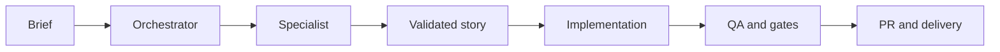

<p align="center">
  
</p>

<p align="center">
  <a href="https://www.npmjs.com/package/sinapse-ai"></a>
  <a href="https://github.com/caioimori/sinapse-ai/actions/workflows/ci.yml"></a>
  <a href="https://www.npmjs.com/package/sinapse-ai"></a>
  <a href="LICENSE"></a>
  <a href="https://nodejs.org/"></a>
</p>

<p align="center">
  <strong>Orchestrate specialized work. Keep engineering under control.</strong>
</p>

<p align="center">
  17 squads &middot; 172 agents &middot; Claude Code + Codex &middot; 11 governance articles
</p>

<p align="center">
  <a href="README.md">Português</a> &middot;
  <a href="docs/getting-started.md">Getting started</a> &middot;
  <a href="https://www.npmjs.com/package/sinapse-ai">npm</a> &middot;
  <a href="https://github.com/caioimori/sinapse-ai/discussions">Discussions</a>
</p>

---

SINAPSE AI is an orchestration framework that installs agents, skills, rules,
and quality gates directly into your project. Claude Code and Codex work from
the same catalog, engineering process, and explicit authority model.

It does not replace your CLI or LLM. It turns an AI session into an auditable
delivery system: brief, routing, story, implementation, QA, and delivery.

## Install with one command

From your project directory:

```bash
npx sinapse-ai@latest install
```

With no flags, a fresh installation configures **Claude Code and Codex**.
Running it again preserves the saved selection and project-owned content.

Then activate the orchestrator:

| Claude Code | Codex |
|---|---|
| `@sinapse-orqx` | `$snps` |

Or call a specialist directly:

| Claude Code | Codex |
|---|---|
| `@developer` | `$sinapse-agent developer` |

> Requirements: Node.js 18+, npm 9+, and at least one supported CLI.

## From request to delivery



```text
You: "Audit this checkout flow and fix the risks you find."

SINAPSE
  -> classifies project, surface, and risk
  -> routes architecture, product, development, and QA
  -> requires a ready story before implementation
  -> validates tests, security, and provider parity
  -> delivers evidence, not just an answer
```

## Why SINAPSE

### Executable governance

The 11-article Constitution defines story-first delivery, role authority,
quality, security, collaboration, and conservative defaults. Hooks and
validators turn those rules into enforceable gates.

### Claude Code + Codex parity

The canonical catalog generates native surfaces for both CLIs. Adapters are
checked for drift: the provider can change while the operating contract remains.

### Coordinated specialization

Seventeen squads cover engineering, product, design, security, growth, content,
finance, and operations. Orchestrators route; specialists execute within clear
boundaries.

## What gets installed

| Capability | Claude Code | Codex |
|---|:---:|:---:|
| 172-agent catalog | Yes | Yes |
| Installed skills | 37 | 37 |
| Native rules and instructions | Yes | Yes |
| Registered hooks | 20 native registrations | 9 lifecycle events |
| Tasks and knowledge bases | Shared | Shared |
| React Bits frontend capability | Skill + corpus | Skill + corpus |

The current inventory contains **1,201 squad tasks**, **211 development tasks**,
**1,412 task files**, and **1,348 pointers resolvable** at runtime.

These counts are measured from the repository. Verify the current state with:

```bash
node .codex/scripts/resolve-codex-agent.js --stats
npm run validate:parity
```

## Use cases

- **New products:** discovery, architecture, stories, implementation, and QA gates.
- **Brownfield systems:** debt and risk diagnosis before incremental changes.
- **Frontend:** design systems, accessibility, React Bits, and reduced-motion support.
- **Security:** threat modeling, secret validation, RLS, and pre-deploy review.
- **Operations:** GitHub Flow, CI, releases, documentation, and traceability.

## Safe operations

```bash
# Install or update while preserving project customizations
npx sinapse-ai@latest install

# Diagnose the environment
npx sinapse-ai@latest doctor

# Apply safe fixes found by the diagnostic
npx sinapse-ai@latest doctor --fix

# Inspect the installed surface
npx sinapse-ai@latest status
```

Use `install --llm=claude-code` or `install --llm=codex` only for a deliberately
restricted installation. Use `install --reconfigure` to change an existing
selection and `install --force` to refresh managed surfaces.

## Ownership architecture

| Layer | Responsibility | Policy |
|---|---|---|
| L1 | Framework core | Immutable |
| L2 | Templates and workflows | Extend-only |
| L3 | Configuration | Mutable with guardrails |
| L4 | Stories, packages, squads, and tests | Project-owned |

Re-runs refresh managed surfaces without treating project code as disposable.
See the [installation policy](docs/installation/README.md).

## Documentation

| Journey | Document |
|---|---|
| Install and route the first request | [Getting started](docs/getting-started.md) |
| Select an engineering workflow | [Engineering applicability](docs/framework/software-engineering-applicability.md) |
| Integrate Claude Code and Codex | [Provider integration](docs/guides/ide-integration.md) |
| Find agents and commands | [Agent reference](docs/agent-reference-guide.md) |
| Use React Bits intentionally | [React Bits](docs/framework/react-bits/index.md) |
| Contribute through the GitFlow | [Contributing](CONTRIBUTING.md) |
| Report vulnerabilities | [Security](SECURITY.md) |
| Get help | [Support](SUPPORT.md) |

## Product and community

- [Roadmap](ROADMAP.md): public direction without artificial delivery promises.
- [Governance](GOVERNANCE.md): decisions, roles, and change policy.
- [Discussions](https://github.com/caioimori/sinapse-ai/discussions): questions and open proposals.
- [Issues](https://github.com/caioimori/sinapse-ai/issues): reproducible bugs and traceable work.
- [Changelog](CHANGELOG.md): release history.

Contributions use short-lived branches, pull requests, stories when applicable,
and automated gates. See [CONTRIBUTING.md](CONTRIBUTING.md).

## License

Distributed under the [MIT License](LICENSE). Derived-work attributions and
trademark notices are documented in [NOTICE.md](NOTICE.md).
