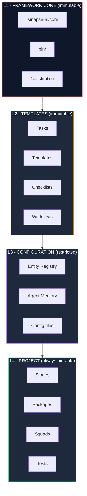
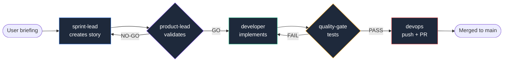

[](https://www.npmjs.com/package/sinapse-ai)
[](LICENSE)
[](https://nodejs.org/)
[](https://github.com/caioimori/sinapse-ai/actions/workflows/ci.yml)

```
 ____  ___ _   _    _    ____  ____  _____
/ ___|/ _ \ \ | |  / \  |  _ \/ ___|| ____|
\___ \ | | |  \| | / _ \ | |_) \___ \|  _|
 ___) | |_| | |\  |/ ___ \|  __/ ___) | |___
|____/ \___/|_| \_/_/   \_\_|   |____/|_____|
```

> **AI squads that build with you, not for you.**

[English] | [**Portugues**](README.md)

---

## What is SINAPSE?

SINAPSE is an open-source meta-framework that organizes **172 AI agents into 17 specialized squads**, operating directly in the terminal via Claude Code or Codex CLI. Each agent has a defined role, each squad masters a discipline, and the entire system is governed by a **Constitution with real enforcement** -- 17 active hooks that block violations at runtime.

The core concept is simple: instead of a single AI assistant trying to do everything, SINAPSE structures work into specialized teams. A branding squad handles visual identity. A cybersecurity squad handles compliance and pentesting. A copywriting squad handles persuasion and conversion. Each with its own knowledge base, workflows, and tasks -- totaling **1,200 executable tasks** ready to use.

Unlike tools that just chat with AI, SINAPSE enforces discipline. The **Documentation-First** pipeline requires a story to be created and validated before any code is written. Quality gates run automatically before merge. Unauthorized agents are blocked from pushing. All via hooks that intercept operations in real time -- not after the fact.

---

## Why does SINAPSE exist?

Generative AI has a known problem: the more you ask of it, the worse it gets. A single assistant trying to do everything -- code, copy, branding, testing, deployment -- loses context, invents features, and suffers from context amnesia after just a few long iterations.

SINAPSE solves this the way human teams solve it: **coordinated specialization**. Instead of one tired generalist, you have 172 agents in 17 squads, each with a defined role, its own knowledge base, and executable tasks. An orchestrator routes your request to whoever actually knows how to solve it -- automatically, without you needing to memorize agent names or commands.

The differential isn't just the quantity of agents. It's **real governance**: 17 active hooks intercept operations at runtime, a Constitution with 11 articles governs the framework, and 7 of those articles are NON-NEGOTIABLE -- violations are blocked before execution, not detected afterwards. **Speed with rigor, without choosing between the two.**

---

## Quick Start

### 1. Install

```bash
npx sinapse-ai install
```

The wizard detects your environment, configures your IDE, and installs squads automatically.

### 2. Verify

```bash
npx sinapse-ai doctor
```

### 3. Activate your first agent

```
@developer          # Activate the development agent
*help               # List available commands
```

Done. You have 17 squads operating in your terminal.

---

## Why install in every project?

Every first installation raises objections. All of them legitimate. Answered here, in the spirit of SINAPSE culture -- direct, no defensiveness.

### "I'll have multiple copies on my computer. Isn't that wasteful?"

No. Each project has its own `.sinapse-ai/` -- just like it has its own `package.json` or `node_modules/`. And this **isn't waste, it's isolation**.

Real footprint: `.sinapse-ai/` weighs ~500KB. Twenty projects = 10MB. Smaller than a single `node_modules/` of a typical Next.js project (300MB+). The disk cost is marginal. The isolation gain is essential.

### "Why not install once globally and be done with it?"

Because open source projects need to be **self-contained**. When you share a project (or someone clones yours), the framework needs to travel with it.

**With local installation:** `git clone` and you're done. Framework, rules, agents, Constitution, context -- everything comes with the project. Any person, any machine, any time: it works the same.

**With global installation:** whoever clones the project has to install SINAPSE separately, ensure the same version, copy rules manually, and pray there's no drift between machines. Open source dies like that.

### "What's the actual difference between global and local?"

| Aspect | Global | Local (recommended) |
|--------|:------:|:-------------------:|
| Disk space | Smaller (1 copy) | Larger (~500KB/project) |
| Per-project versioning | No | Yes |
| Clone = working | No | Yes |
| Project-specific custom rules | No | Yes |
| Team collaboration | Broken | Perfect |
| Update without breaking other projects | No | Yes |
| Open source compatible | No | Yes |

### "Does it work on Windows?"

Yes. Tested on Windows 11, macOS, and Linux. The installer detects the OS automatically. WSL is not required (but recommended for advanced features like automated CodeRabbit review).

### "How do I update without losing my customizations?"

```bash
npx sinapse-ai update
```

The update is **idempotent by design**. L1 (framework core) and L2 (templates) get updated. L3 (configuration) and L4 (your stories, packages, customizations) **are never touched**. You can run `update` as many times as you want, including after customizing rules locally. Nothing is lost.

### TL;DR

Local installation = a bit more disk, much more robustness.

If you work alone and never share projects, global will technically work -- but the moment you join a team, publish open source, or need multiple versions in parallel, local becomes essential.

SINAPSE optimizes for the generic case: **your project should work for anyone who clones it, on any machine, at any time**.

---

## Architecture

### CLI First

```
CLI First  >  Observability Second  >  UI Third
```

All intelligence lives in the terminal. Dashboards observe. The UI is never required to operate the system. This is Article I of the Constitution -- non-negotiable.

### 4-Layer Model

SINAPSE separates framework and project artifacts into 4 layers with automatic protection:



| Layer | Mutability | Content |
|-------|-----------|---------|
| **L1** Framework Core | Never | `.sinapse-ai/core/`, `bin/`, Constitution |
| **L2** Templates | Never | Tasks, templates, checklists, workflows |
| **L3** Configuration | Restricted | Entity registry, agent memory, config |
| **L4** Project | Always | Stories, packages, squads, tests |

Deny rules in `.claude/settings.json` enforce this deterministically. **Framework updates touch L1+L2, never L3+L4** — your customizations are preserved.

### Constitution

SINAPSE is governed by a formal Constitution with 11 articles and 17 enforcement hooks:

| Article | Principle | Severity |
|---------|-----------|----------|
| I | CLI First | NON-NEGOTIABLE |
| II | Agent Authority | NON-NEGOTIABLE |
| III | Documentation-First Development | NON-NEGOTIABLE |
| IV | No Invention | MUST |
| V | Quality First | MUST |
| VI | Absolute Imports | SHOULD |
| VII | Ecosystem Metrics Accuracy | NON-NEGOTIABLE |
| VIII | Mandatory Delegation | NON-NEGOTIABLE |
| IX | Safe Collaboration | NON-NEGOTIABLE |
| X | Security & Data Protection | NON-NEGOTIABLE |
| XI | Conservative Default | MUST |

7 articles are NON-NEGOTIABLE -- violations are automatically blocked before execution.

---

## Agent System

SINAPSE includes 12 core agents covering the complete development cycle:

| Agent | Persona | Role |
|-------|---------|------|
| `sinapse-orqx` | **Imperator** | Master orchestrator -- routing and cross-squad coordination |
| `developer` | **Pixel** | Code implementation and story development |
| `quality-gate` | **Litmus** | Testing, QA, and quality gates |
| `architect` | **Stratum** | Architecture and technology decisions |
| `project-lead` | **Beacon** | Product management and epics |
| `product-lead` | **Axis** | Story validation and prioritization |
| `sprint-lead` | **Sync** | Story creation and sprints |
| `analyst` | **Scope** | Business research and analysis |
| `data-engineer` | **Tensor** | Database design, migrations, and RLS |
| `ux-design-expert` | **Mosaic** | UX/UI design |
| `devops` | **Pipeline** | CI/CD, git push (exclusive), releases |
| `squad-creator` | **Loom** | New squad creation |

Activate any agent with `@agent-name` and use `*help` to see its commands.

### Development Workflow



The framework ensures no step is skipped. Each gate blocks automatically if the previous one wasn't fulfilled.

---

## 17 Specialized Squads

Each squad is an autonomous team with its own orchestrator, specialist agents, knowledge base, tasks, and workflows.

| Squad | Domain | Agents |
|-------|--------|--------|
| **squad-brand** | Brand strategy, archetypes, visual audit | 15 |
| **squad-design** | Design systems, components, tokens, UI, art direction, premium LP | 14 |
| **squad-copy** | Persuasive copywriting, headlines, conversion | 13 |
| **squad-council** | Strategic advisors (Munger, Dalio, Thiel, ...) | 11 |
| **squad-storytelling** | Narrative, scripts, story frameworks | 10 |
| **squad-commercial** | Sales, funnel, revenue, commercial pipeline | 10 |
| **squad-paidmedia** | Meta Ads, Google Ads, campaigns, optimization | 9 |
| **squad-animations** | Motion design, CSS, particles, 3D | 9 |
| **squad-cloning** | Cognitive cloning, mind synthesis, digital twins | 9 |
| **squad-cybersecurity** | Threat intel, pentest, compliance, LGPD | 8 |
| **squad-courses** | Courses, curricula, assessments, educational launch | 8 |
| **squad-research** | Market analysis, competitive intelligence | 7 |
| **claude-code-mastery** | Advanced Claude Code, MCP, deep integration | 8 |
| **squad-content** | Editorial governance, content strategy | 7 |
| **squad-product** | Product discovery, strategy, operations | 7 |
| **squad-growth** | Analytics, CRO, SEO, growth hacking | 7 |
| **squad-finance** | Budget, pricing, profitability analysis | 8 |

**Total: 17 squads, 172 specialized agents, 1,200 tasks**

Activate any squad via its orchestrator:

```
@brand-orqx         # Brand squad
@copy-orqx          # Copy squad
@cyber-orqx         # Cybersecurity squad
@research-orqx      # Research squad
```

The orchestrator receives your request and automatically delegates to the right specialist within the squad.

---

## IDE Support

SINAPSE supports two IDEs with deep integrations:

| IDE | Activation | Highlights |
|-----|------------|------------|
| **Claude Code** | `@agent-name` | Hooks, contextual rules, deny/allow, Chrome Brain |
| **Codex CLI** | `/skills` or `$skill-name` | Native skills, multi-model, `codex exec` for CI/CD |

Both IDEs have access to all 17 squads, 172 agents, workflows, and knowledge bases. The installer detects and configures automatically.

### Parity Table

| Feature | Claude Code | Codex CLI |
|---------|:-----------:|:---------:|
| Agent activation (@agent) | Full | Full |
| Constitutional hooks (20) | Full | Partial (5) |
| Story-driven development | Full | Full |
| Quality gates | Full | Full |
| Delegation enforcement | Full | Partial |
| Secret scanning | Full | Manual |
| CodeRabbit integration | Full | N/A |
| Skills system | Full | Commands |
| MCP servers | Full | N/A |
| Terminal Bus | Full | N/A |

**Claude Code** for the most integrated and automated experience.
**Codex CLI** for model flexibility and CI/CD automation.

---

## Who is SINAPSE for?

SINAPSE isn't for everyone. It's opinionated, rigorous, and demands discipline. But for those who need speed **with rigor**, it transforms generative AI from a toy into real infrastructure.

### Ideal for

- **Technical founders** building SaaS solo or in small teams who need to operate like a large team
- **Consultants and agencies** delivering complete projects (brand + copy + dev + deploy) who need consistent quality across clients
- **Product teams** who want to eliminate inconsistency between requirements, design, implementation, and QA
- **Educators** teaching applied AI who need a real framework to demonstrate in class
- **Independent builders** who treat AI as infrastructure, not as a toy

### Not for

- One-shot projects without continuity or process discipline
- Teams that prefer total flexibility over governance
- Users who expect "magic AI" without methodology

If you identify with the first group, you're in the right place.

---

## Quality and Security

### Constitutional Enforcement

SINAPSE doesn't just document rules -- it enforces them with **17 active hooks**:

- `enforce-git-push-authority.sh` -- blocks push by unauthorized agents
- `enforce-story-gate.cjs` -- blocks code without a validated story
- `sql-governance.py` -- blocks dangerous SQL (injection patterns)
- `enforce-delegation.cjs` -- blocks orchestrators from executing domain work
- `enforce-architecture-first.cjs` -- blocks code in protected paths without documentation

### 25 Deployment Blockers (3 Tiers)

No project goes to production without passing all of them:

- **Tier 1** -- 10 absolute blockers: RLS, zero hardcoded keys, protected service_role, MFA, authenticated APIs, parameterized SQL
- **Tier 2** -- 7 compliance blockers: DPO, consent, data subject rights, breach notification (LGPD)
- **Tier 3** -- 8 operational blockers: logging, backup, vulnerability scanning, incident response

### Quality Gates

```bash
npm run lint           # ESLint
npm run typecheck      # TypeScript
npm test               # Tests
npm run test:coverage  # Coverage
```

Pre-commit and pre-push hooks validate automatically before each operation.

---

## Documentation

| Resource | Link |
|----------|------|
| Getting Started | [docs/guides/getting-started.md](docs/guides/getting-started.md) |
| Architecture | [docs/framework/core-architecture.md](docs/framework/core-architecture.md) |
| Squads Guide | [docs/guides/squads-guide.md](docs/guides/squads-guide.md) |
| Agent Reference | [docs/guides/agent-reference.md](docs/guides/agent-reference.md) |
| Workflows | [docs/guides/workflows-guide.md](docs/guides/workflows-guide.md) |
| Security | [SECURITY.md](SECURITY.md) |
| Contributing | [CONTRIBUTING.md](CONTRIBUTING.md) |

---

## CLI Reference

The public surface is intentional -- four canonical lifecycle commands, two diagnostics, one advanced sub-command.

```bash
# Lifecycle
npx sinapse-ai install           # Install (idempotent -- re-runs are upserts)
npx sinapse-ai install --force   # Reinstall from scratch, ignoring existing state
npx sinapse-ai update            # Update to the latest version
npx sinapse-ai uninstall         # Remove the framework from the project

# Diagnostics
npx sinapse-ai status            # Installation state + list of squads
npx sinapse-ai doctor            # 16 health checks against the environment
npx sinapse-ai doctor --fix      # Auto-fix detected issues
npx sinapse-ai doctor --json     # Machine-readable output for CI
npx sinapse-ai doctor --dry-run  # Show what `--fix` would do without applying

# Advanced
npx sinapse-ai chrome-brain install   # Install browser automation
```

All commands are safe to re-run. To list active agents after installing, open Claude Code or Codex CLI and type `@` to autocomplete.

---

## Contributing

```bash
git clone https://github.com/caioimori/sinapse-ai.git
cd sinapse-ai && npm install
```

1. Fork the repository
2. Create your branch (`git checkout -b feat/my-feature`)
3. Commit (`git commit -m 'feat: description'`)
4. Push (`git push origin feat/my-feature`)
5. Open a Pull Request

See [CONTRIBUTING.md](CONTRIBUTING.md) for full details.

---

## Legal

| Document | Link |
|----------|------|
| License | [MIT](LICENSE) |
| Security | [SECURITY.md](SECURITY.md) |
| Code of Conduct | [CODE_OF_CONDUCT.md](CODE_OF_CONDUCT.md) |
| Contributing | [CONTRIBUTING.md](CONTRIBUTING.md) |

---

## Maintainers

- [@caioimori](https://github.com/caioimori) -- Lead Maintainer
- [@Matheus-soier](https://github.com/Matheus-soier) -- Co-Maintainer

---

## Ready to start?

```bash
npx sinapse-ai install
```

One command. 17 squads. 172 agents. Constitutional governance. All operating directly in the terminal.

**[Full documentation](docs/guides/getting-started.md)** • **[Report issue](https://github.com/caioimori/sinapse-ai/issues)** • **[Discussions](https://github.com/caioimori/sinapse-ai/discussions)**

---

**Built for builders. Governed by a Constitution. Operating 100% in the terminal.**

**[Back to top](#sinapse-ai)**
