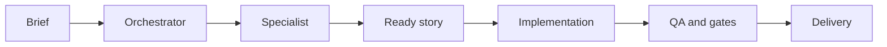

<p align="center">
  <a href="https://www.npmjs.com/package/sinapse-ai"></a>
  <a href="https://github.com/caioimori/sinapse-ai/actions/workflows/ci.yml"></a>
  <a href="LICENSE"></a>
  <a href="https://nodejs.org/"></a>
</p>

<h1 align="center">SINAPSE AI</h1>

<p align="center"><strong>A governed AI team for Claude Code and Codex.</strong></p>

<p align="center">
  17 squads · 172 agents · 1,412 task files · 1,348 resolvable pointers
</p>

<p align="center"><a href="README.md">Portugues</a> · <a href="docs/getting-started.md">Documentation</a> · <a href="https://www.npmjs.com/package/sinapse-ai">npm</a> · <a href="https://github.com/caioimori/sinapse-ai/issues">Issues</a></p>

---

```text
     S I N A P S E
  specialized work, one governed system
```

SINAPSE organizes product, engineering, design, growth, security, and operations
work through coordinated specialists. It does not replace your LLM: it installs
the agent, skill, rule, and quality-gate layer that makes Claude Code and Codex
consistent inside a project.

## Start with one command

From your project directory, run:

```bash
npx sinapse-ai@latest install
```

This is the canonical path for fresh or unconfigured projects. With no flags,
it configures **Claude Code and Codex**. Re-runs preserve the saved provider
and project-owned content. To intentionally install one provider only, use
`--llm=claude-code` or `--llm=codex`; use `--reconfigure` to change an existing selection.

```text
install -> native agents and skills -> rules and hooks -> ready project
```

| After installation | Claude Code | Codex |
|---|---|---|
| Orchestrator | `@sinapse-orqx` | `$snps` |
| Specialist | `@developer` | `$sinapse-agent developer` |
| Reconfigure providers | `npx sinapse-ai@latest install --reconfigure` | same command |

## What ships with the project

| Surface | Claude Code | Codex |
|---|:---:|:---:|
| Canonical agents | 172 | 172 |
| Installed skills | 37 | 37 |
| Registered hooks | 20 native registrations | 9 lifecycle events |
| React Bits | Skill plus 9-file corpus | Skill plus 9-file corpus |

The catalog contains 17 squads and 172 specialized agents. The runtime measures
1,201 squad tasks, 211 development tasks, 1,412 task files, and 1,348 pointers resolvable
at runtime. React Bits is included as a frontend capability with a searchable
snapshot of 139 components and performance, accessibility, and reduced-motion
guidance.

## How work flows



The framework applies an 11-article Constitution: documentation before code,
clear authority per agent, security, quality, and safe collaboration. The
orchestrator routes, specialists execute, and the process leaves evidence.

## Essential commands

```bash
# Install or synchronize both providers in the current project
npx sinapse-ai@latest install

# Update an installation without losing project customizations
npx sinapse-ai@latest update

# Diagnose and fix the environment
npx sinapse-ai@latest doctor --fix

# Show the installed surface
npx sinapse-ai@latest status
```

`install --force` reinstalls managed surfaces. `install --reconfigure` opens
provider selection only in interactive terminals; non-interactive runs use both.
`install --global-only` configures only global adapters and does not change the
current project.

## Architecture that respects the project

| Layer | Responsibility | Policy |
|---|---|---|
| L1 | Framework core | Immutable |
| L2 | Templates and workflows | Extend-only |
| L3 | Configuration | Mutable with guardrails |
| L4 | Stories, packages, squads, and tests | Always project-owned |

Updates refresh managed content and preserve local work. Gates also prevent
unauthorized pushes, code writes without a validated story, unsafe SQL, and
Claude/Codex drift.

## Who it is for

- Teams that want specialized AI without losing traceability.
- Projects that need the same contract in Claude Code and Codex.
- Product work that values story-first development, QA, security, and gradual delivery.
- Builders who prefer clear commands over a pile of improvised prompts.

## Documentation

| Topic | Link |
|---|---|
| Getting started | [docs/getting-started.md](docs/getting-started.md) |
| Claude Code and Codex integration | [docs/guides/ide-integration.md](docs/guides/ide-integration.md) |
| Engineering workflows | [docs/framework/software-engineering-applicability.md](docs/framework/software-engineering-applicability.md) |
| Agent reference | [docs/agent-reference-guide.md](docs/agent-reference-guide.md) |
| React Bits | [docs/framework/react-bits/index.md](docs/framework/react-bits/index.md) |
| Security | [SECURITY.md](SECURITY.md) |
| Contributing | [CONTRIBUTING.md](CONTRIBUTING.md) |

## Contributing

```bash
git clone https://github.com/caioimori/sinapse-ai.git
cd sinapse-ai
npm install
npm test
```

Open a branch, keep the story and gates current, then submit a pull request.
See [CONTRIBUTING.md](CONTRIBUTING.md) for the complete process.

## License

MIT. See [LICENSE](LICENSE).
