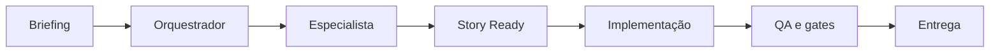

<p align="center">
  <a href="https://www.npmjs.com/package/sinapse-ai"></a>
  <a href="https://github.com/caioimori/sinapse-ai/actions/workflows/ci.yml"></a>
  <a href="LICENSE"></a>
  <a href="https://nodejs.org/"></a>
</p>

<h1 align="center">SINAPSE AI</h1>

<p align="center"><strong>Uma equipe de IA governada para Claude Code e Codex.</strong></p>

<p align="center">
  17 squads · 172 agentes · 1.412 task files · 1.348 ponteiros resolvíveis
</p>

<p align="center"><a href="README.en.md">English</a> · <a href="docs/getting-started.md">Documentação</a> · <a href="https://www.npmjs.com/package/sinapse-ai">npm</a> · <a href="https://github.com/caioimori/sinapse-ai/issues">Issues</a></p>

---

```text
     S I N A P S E
  specialized work, one governed system
```

SINAPSE organiza trabalho de produto, engenharia, design, growth, segurança e
operação em especialistas coordenados. Ele não troca sua LLM: instala a camada
de agentes, skills, regras e quality gates que torna Claude Code e Codex
consistentes dentro do projeto.

## Comece com um comando

No diretório do projeto, execute:

```bash
npx sinapse-ai@latest install
```

Esse é o caminho canônico para instalações novas ou sem provider salvo. Sem
flags, ele configura **Claude Code e Codex**; repetições preservam o provider
salvo e o conteúdo do projeto. Para limitar conscientemente a um provider, use
`--llm=claude-code` ou `--llm=codex`; use `--reconfigure` para mudar uma seleção existente.

```text
install -> agentes e skills nativos -> regras e hooks -> projeto pronto
```

| Depois da instalação | Claude Code | Codex |
|---|---|---|
| Orquestrador | `@sinapse-orqx` | `$snps` |
| Especialista | `@developer` | `$sinapse-agent developer` |
| Reconfigurar providers | `npx sinapse-ai@latest install --reconfigure` | mesmo comando |

## O que entra no seu projeto

| Superfície | Claude Code | Codex |
|---|:---:|:---:|
| Agentes canônicos | 172 | 172 |
| Skills instaladas | 37 | 37 |
| Hooks registrados | 20 registros | 9 eventos |
| React Bits | Skill + corpus de 9 arquivos | Skill + corpus de 9 arquivos |

O catálogo tem 17 squads e 172 agentes especializados. O runtime mede 1.201
squad tasks, 211 development tasks, 1.412 task files e 1.348 ponteiros
resolvíveis. React Bits está incluído como capacidade de frontend, com um
snapshot pesquisável de 139 componentes e regras de desempenho, acessibilidade
e movimento reduzido.

## Como o trabalho flui



O framework aplica uma Constitution com 11 artigos: documentação antes de
código, autoridade clara por agente, segurança, qualidade e colaboração segura.
O orquestrador roteia; especialistas executam; o processo deixa evidências.

## Comandos essenciais

```bash
# Instalar ou sincronizar os dois providers no projeto atual
npx sinapse-ai@latest install

# Atualizar uma instalação sem perder customizações de projeto
npx sinapse-ai@latest update

# Diagnosticar e corrigir o ambiente
npx sinapse-ai@latest doctor --fix

# Ver a superficie instalada
npx sinapse-ai@latest status
```

`install --force` reinstala a superfície gerenciada. `install --reconfigure`
abre a escolha de provider somente em terminais interativos; em modo não
interativo, ele usa ambos. `install --global-only` configura apenas os adapters
globais, sem alterar o projeto atual.

## Arquitetura que respeita o projeto

| Camada | Responsabilidade | Política |
|---|---|---|
| L1 | Core do framework | Imutável |
| L2 | Templates e workflows | Extend-only |
| L3 | Configuração | Mutável com guardrails |
| L4 | Stories, packages, squads e testes | Sempre do projeto |

Atualizações renovam o que é gerenciado e preservam trabalho local. Os gates
também evitam push indevido, escrita sem story validada, SQL perigoso e drift
entre Claude Code e Codex.

## Para quem é

- Times que querem IA especializada sem perder rastreabilidade.
- Projetos que precisam do mesmo contrato em Claude Code e Codex.
- Produtos que valorizam story-first, QA, segurança e entrega incremental.
- Pessoas que preferem comandos claros a um conjunto de prompts improvisados.

## Documentação

| Tema | Link |
|---|---|
| Primeiros passos | [docs/getting-started.md](docs/getting-started.md) |
| Integracao Claude Code e Codex | [docs/guides/ide-integration.md](docs/guides/ide-integration.md) |
| Workflows de engenharia | [docs/framework/software-engineering-applicability.md](docs/framework/software-engineering-applicability.md) |
| Referência de agentes | [docs/agent-reference-guide.md](docs/agent-reference-guide.md) |
| React Bits | [docs/framework/react-bits/index.md](docs/framework/react-bits/index.md) |
| Segurança | [SECURITY.md](SECURITY.md) |
| Contribuir | [CONTRIBUTING.md](CONTRIBUTING.md) |

## Contribuição

```bash
git clone https://github.com/caioimori/sinapse-ai.git
cd sinapse-ai
npm install
npm test
```

Abra uma branch, mantenha a story e os gates atualizados, e envie uma PR. Veja
[CONTRIBUTING.md](CONTRIBUTING.md) para o fluxo completo.

## Licença

MIT. Veja [LICENSE](LICENSE).
