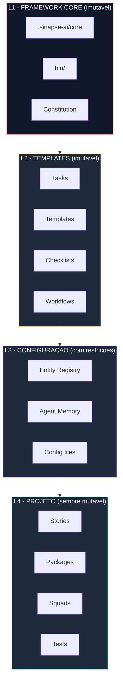

[](https://www.npmjs.com/package/sinapse-ai)
[](LICENSE)
[](https://nodejs.org/)
[](https://github.com/caioimori/sinapse-ai/actions/workflows/ci.yml)
[](https://github.com/caioimori/sinapse-ai/actions/workflows/ci.yml)
[](.sinapse-ai/constitution.md)

```
 ____  ___ _   _    _    ____  ____  _____
/ ___|/ _ \ \ | |  / \  |  _ \/ ___|| ____|
\___ \ | | |  \| | / _ \ | |_) \___ \|  _|
 ___) | |_| | |\  |/ ___ \|  __/ ___) | |___
|____/ \___/|_| \_/_/   \_\_|   |____/|_____|
```

> **Squads de IA que constroem com voce, nao para voce.**

[**Portugues**] | [English](README.en.md)

---

## O que e o SINAPSE?

SINAPSE e um meta-framework open source que organiza **172 agentes de IA em 17 squads especializados**, operando direto no terminal via Claude Code ou Codex CLI. Cada agente tem um papel definido, cada squad domina uma disciplina, e o sistema inteiro e governado por uma **Constitution com enforcement real** — 13 hooks ativos que bloqueiam violacoes em tempo de execucao.

O conceito central e simples: em vez de um unico assistente de IA tentando fazer tudo, o SINAPSE estrutura o trabalho em equipes especializadas. Um squad de branding cuida da identidade visual. Um squad de cybersecurity cuida de compliance e pentest. Um squad de copywriting cuida de persuasao e conversao. Cada um com sua propria knowledge base, workflows e tasks — totalizando **1.200 tasks executaveis** prontas para uso, distribuidas pelos 17 squads.

Diferente de ferramentas que apenas conversam com IA, o SINAPSE impoe disciplina. O pipeline **Documentation-First** exige que uma story seja criada e validada antes de qualquer linha de codigo. Quality gates rodam automaticamente antes de merge. Agentes nao autorizados sao bloqueados de fazer push. Tudo isso via hooks que interceptam operacoes em tempo real — nao depois.

---

## Por que SINAPSE existe?

IA generativa tem um problema conhecido: quanto mais voce pede, pior fica. Um unico assistente tentando fazer tudo — codigo, copy, branding, testes, deploy — perde contexto, inventa features e sofre de context amnesia depois de poucas iteracoes longas.

SINAPSE resolve isso do jeito que times humanos resolvem: **especializacao coordenada**. Em vez de um generalista cansado, voce tem 172 agentes em 17 squads, cada um com papel definido, knowledge base propria e tasks executaveis. Um orquestrador roteia seu pedido para quem realmente sabe resolver — automaticamente, sem voce precisar decorar agent names ou comandos.

O diferencial nao e apenas quantidade de agentes. E **governanca real**: 13 hooks ativos interceptam operacoes em tempo de execucao, uma Constitution com 10 artigos rege o framework, e 6 desses artigos sao NON-NEGOTIABLE — violacoes sao bloqueadas antes de executar, nao detectadas depois. **Velocidade com rigor, sem escolher entre os dois.**

---

<!-- BEGIN GROUNDING (Story 10.47) -->
## Grounding semantico (opt-in, foundation pre-GA)

Frameworks de agente assumem que o LLM ja sabe o que importa no seu projeto. SINAPSE-AI inverte: oferece **tres canais opcionais** para ancorar o agente no seu contexto real — vault de notas, design system, brandbook. Configuracao zero-overhead agora; injecao semantica completa entra nas proximas releases da linha 1.x.

| Canal | Funcao na release atual | Injecao semantica |
|-------|------------------------|-------------------|
| **Vault** | Detecta `~/.claude/sinapse-ai-config.yaml`, valida schema e expoe o path do seu vault aos hooks shipados | Roadmap — proxima minor 1.x |
| **Design System** | Mesma foundation: detecta DS configurado, expoe path. Quando ausente, agentes seguem defaults de alta qualidade | Roadmap — proxima minor 1.x |
| **Brand** | Mesma foundation: detecta brandbook, expoe path. Quando ausente, agentes seguem tom neutro | Roadmap — proxima minor 1.x |

**Por que configurar agora:** os 3 hooks ja sao shipados zero-overhead — sem config, `no-op` completo, zero ruido. Voce define os paths uma vez via `npx sinapse-ai install`, e quando a injecao semantica entrar, ativa automaticamente. Nada de reconfigurar, nada de migrar.

**Por que isso e diferencial:** outros frameworks de agente acoplam grounding ao runtime do framework (te forcam a entrar no ecossistema deles). SINAPSE-AI mantem grounding como **camada opt-in declarativa** — voce escolhe quando e o que ativar, em arquivo proprio, sem lock-in.

Configuracao detalhada: [`docs/guides/grounding-setup.md`](docs/guides/grounding-setup.md).
<!-- END GROUNDING (Story 10.47) -->

---

## Quick Start

### 1. Instale

```bash
npx sinapse-ai install
```

O wizard detecta seu ambiente, escolhe a IDE (Claude Code ou Codex), e instala os 17 squads automaticamente. Re-rodar o comando faz upsert idempotente — preserva suas customizacoes e so atualiza o que mudou.

### 2. Verifique

```bash
npx sinapse-ai status   # Lista de squads + agentes instalados
npx sinapse-ai doctor   # 12 health checks contra o ambiente
```

Se algo estiver fora do lugar, `doctor --fix` corrige automaticamente.

### 3. Ative seu primeiro agente

```
@developer          # Ativa o agente de desenvolvimento
*help               # Lista comandos disponiveis
```

Pronto. Voce tem 17 squads operando no seu terminal.

> **Nota sobre `npm install`:** A partir da v10.0.0-rc.4, o SINAPSE roda um postinstall automatico que sincroniza agents para o Claude Code, cria os diretorios de runtime (`.sinapse/handoffs/`, `.sinapse/scratchpad/`) e executa um health check rapido. Para desabilitar (CI, pipelines avancadas), defina `SINAPSE_SKIP_POSTINSTALL=1` antes do `npm install`, ou rode `npm install --ignore-scripts` (comportamento nativo do npm — nenhum postinstall eh executado). Nesse caso, rode `sinapse doctor --fix` apos a instalacao para garantir que o ambiente esteja pronto.

---

## Por que instalar em cada projeto?

Toda primeira instalacao levanta objecoes. Todas legitimas. Respondidas aqui, no espirito da cultura SINAPSE — direto, sem defensivo.

### "Vou ter multiplas copias no computador. Nao e desperdicio?"

Nao. Cada projeto tem seu proprio `.sinapse-ai/` — assim como tem seu proprio `package.json` ou `node_modules/`. E isso **nao e desperdicio, e isolamento**.

Tamanho real: `.sinapse-ai/` pesa ~500KB. Vinte projetos = 10MB. Menor que um unico `node_modules/` de um projeto Next.js tipico (300MB+). O custo de espaco e marginal. O ganho de isolamento e essencial.

### "Por que nao instalar uma vez global e pronto?"

Porque projetos open source precisam ser **auto-contidos**. Quando voce compartilha um projeto (ou alguem clona o seu), o framework precisa viajar junto.

**Com instalacao local:** `git clone` e pronto. Framework, rules, agentes, Constitution, contexto — tudo ja vem no projeto. Qualquer pessoa, qualquer maquina, qualquer horario: funciona igual.

**Com instalacao global:** quem clona o projeto precisa instalar SINAPSE separado, garantir a mesma versao, copiar rules manualmente, torcer pra nao ter drift entre maquinas. Open source morre assim.

### "Qual a diferenca real entre global e local?"

| Aspecto | Global | Local (recomendado) |
|---------|:------:|:-------------------:|
| Espaco em disco | Menor (1 copia) | Maior (~500KB/projeto) |
| Versionamento per-project | Nao | Sim |
| Clone e funcionando | Nao | Sim |
| Rules customizadas por projeto | Nao | Sim |
| Colaboracao em time | Quebrada | Perfeita |
| Atualizar sem quebrar outros projetos | Nao | Sim |
| Open source compativel | Nao | Sim |

### "Funciona no Windows?"

Sim. Testado em Windows 11, macOS e Linux. O instalador detecta o OS automaticamente. WSL nao e obrigatorio (mas recomendado para algumas features avancadas como review automatizado via CodeRabbit).

### Matriz de plataformas suportadas

Cada release passa por uma matriz de instalacao de 27 combinacoes (3 OSes x 3 package managers x 3 metodos) executada em CI. A tabela abaixo resume os caminhos oficialmente suportados:

| OS | npm | pnpm | Yarn v2+ (Berry) | Yarn v1 (Classic) |
|----|:---:|:----:|:----------------:|:-----------------:|
| Windows 11 | Sim | Sim | Sim | **Nao** |
| macOS (latest) | Sim | Sim | Sim | Sim |
| Linux (Ubuntu 22.04) | Sim | Sim | Sim | Sim |

**Sobre Yarn v1 no Windows:** Yarn v1 (Classic) esta em modo manutencao desde 2020, com Yarn v2+ (Berry) como sucessor oficial. A combinacao Windows + Yarn v1 apresenta falhas de resolucao de wrapper que nao compensam investigar por ser ecossistema em declinio. Usuarios Windows em Yarn v1 devem migrar para Yarn v2+ (recomendado) ou usar npm/pnpm. macOS e Linux em Yarn v1 continuam suportados.

Registro completo da decisao e resultados: [docs/audits/install-matrix-2026-04-16.md](docs/audits/install-matrix-2026-04-16.md).

### "Como atualizar sem perder minhas customizacoes?"

```bash
npx sinapse-ai update
```

O update e **idempotente por design**. L1 (framework core) e L2 (templates) sao atualizados. L3 (configuracao) e L4 (suas stories, packages, customizacoes) **nunca sao tocados**. Voce pode rodar `update` quantas vezes quiser, inclusive apos customizar rules localmente. Nada se perde.

### TL;DR

Instalacao local = um pouco mais de disco, muito mais robustez.

Se voce trabalha sozinho e nunca compartilha projetos, global ate funciona — mas assim que voce entra em time, publica open source ou precisa de multiplas versoes em paralelo, local vira imprescindivel.

O SINAPSE otimiza para o caso generico: **seu projeto deve funcionar para qualquer pessoa que clone ele, em qualquer maquina, a qualquer hora**.

---

## Arquitetura

### CLI First

```
CLI First  >  Observability Second  >  UI Third
```

Toda inteligencia vive no terminal. Dashboards observam. A UI nunca e requisito para operar o sistema. Esse e o Artigo I da Constitution — inegociavel.

### Modelo de 4 Camadas

O SINAPSE separa artefatos do framework e do projeto em 4 camadas com protecao automatica:



| Camada | Mutabilidade | Conteudo |
|--------|-------------|----------|
| **L1** Framework Core | Nunca | `.sinapse-ai/core/`, `bin/`, Constitution |
| **L2** Templates | Nunca | Tasks, templates, checklists, workflows |
| **L3** Configuracao | Com restricoes | Entity registry, agent memory, config |
| **L4** Projeto | Sempre | Stories, packages, squads, testes |

Deny rules em `.claude/settings.json` reforcam isso deterministicamente. **Update do framework atualiza L1+L2, nunca L3+L4** — suas customizacoes sao preservadas.

### Constitution

O SINAPSE e governado por uma Constitution formal com 10 artigos e 13 hooks de enforcement:

| Artigo | Principio | Severidade |
|--------|-----------|------------|
| I | CLI First | NON-NEGOTIABLE |
| II | Agent Authority | NON-NEGOTIABLE |
| III | Documentation-First Development | NON-NEGOTIABLE |
| IV | No Invention | MUST |
| V | Quality First | MUST |
| VI | Absolute Imports | SHOULD |
| VII | Ecosystem Metrics Accuracy | NON-NEGOTIABLE |
| VIII | Mandatory Delegation | NON-NEGOTIABLE |
| IX | Safe Collaboration | NON-NEGOTIABLE |
| X | Security & Data Protection | NON-NEGOTIABLE |

6 artigos sao NON-NEGOTIABLE — violacoes sao bloqueadas automaticamente antes de executar.

---

## Sistema de Agentes

O SINAPSE inclui 12 agentes core que cobrem o ciclo completo de desenvolvimento:

| Agente | Persona | Papel |
|--------|---------|-------|
| `sinapse-orqx` | **Imperator** | Orquestrador principal — routing e coordenacao cross-squad |
| `developer` | **Pixel** | Implementacao de codigo e story development |
| `quality-gate` | **Litmus** | Testes, QA e quality gates |
| `architect` | **Stratum** | Arquitetura e decisoes de tecnologia |
| `project-lead` | **Beacon** | Product management e epics |
| `product-lead` | **Axis** | Validacao de stories e priorizacao |
| `sprint-lead` | **Sync** | Criacao de stories e sprints |
| `analyst` | **Scope** | Pesquisa e analise de negocios |
| `data-engineer` | **Tensor** | Database design, migrations e RLS |
| `ux-design-expert` | **Mosaic** | UX/UI design |
| `devops` | **Pipeline** | CI/CD, git push (exclusivo), releases |
| `squad-creator` | **Loom** | Criacao de novos squads |

Ative qualquer agente com `@agent-name` e use `*help` para ver seus comandos.

### Workflow de Desenvolvimento


O framework garante que nenhuma etapa seja pulada. Cada gate bloqueia automaticamente se a anterior nao foi cumprida.

---

## 17 Squads Especializados

Cada squad e uma equipe autonoma com orquestrador, agentes especialistas, knowledge base, tasks e workflows proprios.

| Squad | Dominio | Agentes |
|-------|---------|---------|
| **squad-brand** | Estrategia de marca, arquetipos, auditoria visual | 15 |
| **squad-design** | Design systems, componentes, tokens, UI, art direction, LP premium | 14 |
| **squad-copy** | Copywriting persuasivo, headlines, conversao | 14 |
| **squad-council** | Advisors estrategicos (Munger, Dalio, Thiel, ...) | 11 |
| **squad-storytelling** | Narrativa, roteiros, frameworks de historia | 11 |
| **squad-commercial** | Vendas, funil, revenue, pipeline comercial | 11 |
| **squad-paidmedia** | Meta Ads, Google Ads, campanhas, otimizacao | 10 |
| **squad-animations** | Motion design, CSS, particulas, 3D | 9 |
| **squad-cloning** | Clonagem cognitiva, mind synthesis, digital twins | 9 |
| **squad-cybersecurity** | Threat intel, pentest, compliance, LGPD | 9 |
| **squad-courses** | Cursos, curriculos, assessments, launch educacional | 8 |
| **squad-research** | Market analysis, inteligencia competitiva | 8 |
| **claude-code-mastery** | Claude Code avancado, MCP, integracao profunda | 8 |
| **squad-content** | Governanca editorial, estrategia de conteudo | 7 |
| **squad-product** | Product discovery, estrategia, operacoes | 7 |
| **squad-growth** | Analytics, CRO, SEO, growth hacking | 7 |
| **squad-finance** | Budget, pricing, profitability analysis | 5 |

**Total: 17 squads, 172 agentes especializados, 1.200 tasks**

Cada squad e ativado via seu orquestrador:

```
@brand-orqx         # Squad de brand
@copy-orqx          # Squad de copy
@cyber-orqx         # Squad de cybersecurity
@research-orqx      # Squad de research
```

O orquestrador recebe seu pedido e delega automaticamente ao especialista correto dentro do squad.

---

## IDE Support

O SINAPSE suporta duas IDEs com integracoes profundas:

| IDE | Ativacao | Destaques |
|-----|----------|-----------|
| **Claude Code** | `@agent-name` | Hooks, rules contextuais, deny/allow, Chrome Brain |
| **Codex CLI** | `/skills` ou `$skill-name` | Skills nativas, multi-model, `codex exec` para CI/CD |

Ambas as IDEs tem acesso a todos os 17 squads, 172 agentes, workflows e knowledge bases. O installer detecta e configura automaticamente.

### Tabela de Paridade

| Funcionalidade | Claude Code | Codex CLI |
|---------------|:-----------:|:---------:|
| Ativacao de agentes (@agent) | Completo | Completo |
| Hooks constitucionais (19) | Completo | Parcial (5) |
| Story-driven development | Completo | Completo |
| Quality gates | Completo | Completo |
| Enforcement de delegacao | Completo | Parcial |
| Secret scanning | Completo | Manual |
| Integracao CodeRabbit | Completo | N/A |
| Sistema de skills | Completo | Comandos |
| MCP servers | Completo | N/A |
| Terminal Bus | Completo | N/A |

**Claude Code** para a experiencia mais integrada e automatizada.
**Codex CLI** para flexibilidade de modelo e automacao CI/CD.

---

## Para quem e o SINAPSE?

O SINAPSE nao e para todo mundo. Ele e opinativo, rigoroso e exige disciplina. Mas para quem precisa de velocidade **com rigor**, ele transforma IA generativa de brinquedo em infraestrutura real.

### Ideal para

- **Founders tecnicos** que constroem SaaS sozinho ou em times pequenos e precisam operar como um time grande
- **Consultores e agencias** que entregam projetos completos (brand + copy + dev + deploy) e precisam de qualidade consistente entre clientes
- **Teams de produto** que querem eliminar inconsistencia entre requisitos, design, implementacao e QA
- **Educadores** que ensinam IA aplicada e precisam de um framework real para demonstrar em aula
- **Builders independentes** que tratam IA como infraestrutura, nao como brinquedo

### Nao e para

- Projetos one-shot sem continuidade ou disciplina processual
- Equipes que preferem flexibilidade total sobre governanca
- Usuarios que esperam "IA magica" sem metodologia

Se voce se identifica com o primeiro grupo, voce esta no lugar certo.

---

## Qualidade e Seguranca

### Enforcement Constitucional

O SINAPSE nao apenas documenta regras — ele as impoe com **13 hooks ativos**:

- `enforce-git-push-authority.sh` — bloqueia push por agentes nao autorizados
- `enforce-story-gate.cjs` — bloqueia codigo sem story validada
- `sql-governance.py` — bloqueia SQL perigoso (injection patterns)
- `enforce-delegation.cjs` — bloqueia orquestradores executando trabalho de dominio
- `enforce-architecture-first.cjs` — bloqueia codigo em paths protegidos sem documentacao

### 25 Deployment Blockers (3 Tiers)

Nenhum projeto vai para producao sem passar por todos:

- **Tier 1** — 10 blockers absolutos: RLS, zero hardcoded keys, service_role protegido, MFA, APIs autenticadas, SQL parametrizado
- **Tier 2** — 7 blockers de compliance: DPO, consentimento, direitos do titular, notificacao de breach (LGPD)
- **Tier 3** — 8 blockers operacionais: logging, backup, vulnerability scanning, incident response

### Quality Gates

```bash
npm run lint           # ESLint
npm run typecheck      # TypeScript
npm test               # Testes
npm run test:coverage  # Cobertura
```

Pre-commit e pre-push hooks validam automaticamente antes de cada operacao.

---

## Documentacao

| Recurso | Link |
|---------|------|
| Getting Started | [docs/guides/getting-started.md](docs/guides/getting-started.md) |
| Quickstart (recording) | [docs/examples/quickstart-recording.md](docs/examples/quickstart-recording.md) |
| Erros do CLI (troubleshooting) | [docs/guides/cli-errors.md](docs/guides/cli-errors.md) |
| Arquitetura | [docs/framework/core-architecture.md](docs/framework/core-architecture.md) |
| Guia de Squads | [docs/guides/squads-guide.md](docs/guides/squads-guide.md) |
| Referencia de Agentes | [docs/guides/agent-reference.md](docs/guides/agent-reference.md) |
| Workflows | [docs/guides/workflows-guide.md](docs/guides/workflows-guide.md) |
| Seguranca | [SECURITY.md](SECURITY.md) |
| Contribuicao | [CONTRIBUTING.md](CONTRIBUTING.md) |

---

## CLI Reference

A superficie publica e proposital — quatro comandos canonicos de lifecycle, dois diagnosticos, um sub-comando avancado.

```bash
# Lifecycle
npx sinapse-ai install           # Instala (idempotente — re-runs sao upserts)
npx sinapse-ai install --force   # Reinstala do zero, ignorando estado existente
npx sinapse-ai update            # Atualiza para a versao mais recente
npx sinapse-ai uninstall         # Remove o framework do projeto

# Diagnostico
npx sinapse-ai status            # Estado da instalacao + lista de squads
npx sinapse-ai doctor            # 12 health checks contra o ambiente
npx sinapse-ai doctor --fix      # Auto-corrige problemas detectados
npx sinapse-ai doctor --json     # Saida machine-readable para CI
npx sinapse-ai doctor --dry-run  # Mostra o que `--fix` faria sem aplicar

# Avancado
npx sinapse-ai chrome-brain install   # Instala browser automation
```

Todos os comandos sao seguros para re-rodar. Para listar agentes ativos depois de instalar, abra Claude Code ou Codex CLI e digite `@` para autocompletar.

---

## Contribuindo

```bash
git clone https://github.com/caioimori/sinapse-ai.git
cd sinapse-ai && npm install
```

1. Fork o repositorio
2. Crie sua branch (`git checkout -b feat/minha-feature`)
3. Commit (`git commit -m 'feat: descricao'`)
4. Push (`git push origin feat/minha-feature`)
5. Abra um Pull Request

Veja [CONTRIBUTING.md](CONTRIBUTING.md) para detalhes completos.

---

## Legal

| Documento | Link |
|-----------|------|
| Licenca | [MIT](LICENSE) |
| Seguranca | [SECURITY.md](SECURITY.md) |
| Codigo de Conduta | [CODE_OF_CONDUCT.md](CODE_OF_CONDUCT.md) |
| Contribuicao | [CONTRIBUTING.md](CONTRIBUTING.md) |

---

## Maintainers

- [@caioimori](https://github.com/caioimori) — Lead Maintainer
- [@Matheus-soier](https://github.com/Matheus-soier) — Co-Maintainer

---

## Pronto para comecar?

```bash
npx sinapse-ai install
```

Um comando. 17 squads. 172 agentes. Governanca constitucional. Tudo operando direto no terminal.

**[Documentacao completa](docs/guides/getting-started.md)** • **[Reportar issue](https://github.com/caioimori/sinapse-ai/issues)** • **[Discussions](https://github.com/caioimori/sinapse-ai/discussions)**

---

**Construido para quem constroi. Governado por uma Constitution. Operando 100% no terminal.**

**[Voltar ao topo](#sinapse-ai)**
