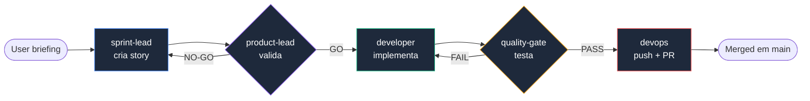

[](https://www.npmjs.com/package/sinapse-ai)
[](LICENSE)
[](https://nodejs.org/)
[](https://github.com/caioimori/sinapse-ai/actions/workflows/ci.yml)
[](https://github.com/caioimori/sinapse-ai/actions/workflows/ci.yml)
[](.sinapse-ai/constitution.md)

```
 ____  ___ _   _    _    ____  ____  _____
/ ___|/ _ \ \ | |  / \  |  _ \/ ___|| ____|
\___ \ | | |  \| | / _ \ | |_) \___ \|  _|
 ___) | |_| | |\  |/ ___ \|  __/ ___) | |___
|____/ \___/|_| \_/_/   \_\_|   |____/|_____|
```

> **Squads de IA que constroem com você, não para você.**

[**Português**] | [English](README.en.md)

---

## O que é o SINAPSE?

SINAPSE é um meta-framework open source que organiza **172 agentes de IA em 17 squads especializados**, operando direto no terminal via Claude Code ou Codex CLI. Cada agente tem um papel definido, cada squad domina uma disciplina, e o sistema inteiro é governado por uma **Constitution com enforcement real** — 20 hooks registrados que bloqueiam violações em tempo de execução.

O conceito central é simples: em vez de um único assistente de IA tentando fazer tudo, o SINAPSE estrutura o trabalho em equipes especializadas. Um squad de branding cuida da identidade visual. Um squad de cybersecurity cuida de compliance e pentest. Um squad de copywriting cuida de persuasão e conversão. Cada um com sua própria knowledge base, workflows e tasks. O runtime mede **1.412 task files**: **1.201 squad tasks** nos 17 squads e **211 development tasks**. Desses arquivos, **1.348 são resolvíveis** pelos ponteiros reais dos agentes.

Diferente de ferramentas que apenas conversam com IA, o SINAPSE impõe disciplina. O pipeline **Documentation-First** exige que uma story seja criada e validada antes de qualquer linha de código. Quality gates rodam automaticamente antes de merge. Agentes não autorizados são bloqueados de fazer push. Tudo isso via hooks que interceptam operações em tempo real — não depois.

---

## Por que o SINAPSE existe?

IA generativa tem um problema conhecido: quanto mais você pede, pior fica. Um único assistente tentando fazer tudo — código, copy, branding, testes, deploy — perde contexto, inventa features e sofre de context amnesia depois de poucas iterações longas.

O SINAPSE resolve isso do jeito que times humanos resolvem: **especialização coordenada**. Em vez de um generalista cansado, você tem 172 agentes em 17 squads, cada um com papel definido, knowledge base própria e tasks executáveis. Um orquestrador roteia seu pedido para quem realmente sabe resolver — automaticamente, sem você precisar decorar nomes de agentes ou comandos.

O diferencial não é apenas a quantidade de agentes. É **governança real**: 20 hooks registrados interceptam operações em tempo de execução, uma Constitution com 11 artigos rege o framework, e 7 desses artigos são NON-NEGOTIABLE — violações são bloqueadas antes de executar, não detectadas depois. **Velocidade com rigor, sem escolher entre os dois.**

---

## Quick Start

> Use `@latest` nos comandos publicos para evitar que o cache do `npx` execute
> uma versao anterior durante instalacoes e atualizacoes.

### 1. Instale

```bash
npx sinapse-ai@latest install
```

O wizard detecta seu ambiente, escolhe a IDE (Claude Code ou Codex) e instala os 17 squads automaticamente. Re-rodar o comando faz upsert idempotente — preserva suas customizações e só atualiza o que mudou.

### 2. Verifique

```bash
npx sinapse-ai@latest status   # Lista de squads + agentes instalados
npx sinapse-ai@latest doctor   # 16 health checks contra o ambiente
```

Se algo estiver fora do lugar, `doctor --fix` corrige automaticamente.

### 3. Ative seu primeiro agente

Claude Code:

```text
@developer
*help
```

Codex:

```text
$snps
$sinapse-agent developer
```

Pronto. Você tem 17 squads operando no seu terminal.

> **Nota sobre `npm install`:** o SINAPSE **não** roda um postinstall automático. Por segurança de cadeia de suprimentos, nada é executado sozinho ao instalar o pacote via `npm install`. O setup — sincronizar agents para o Claude Code, criar os diretórios de runtime (`.sinapse/handoffs/`, `.sinapse/scratchpad/`) e rodar um health check rápido — acontece **explicitamente** quando você roda `npx sinapse-ai install` (ou `npm run setup`). Para pular o setup nessas execuções explícitas (CI, pipelines avançadas), defina `SINAPSE_SKIP_POSTINSTALL=1` — em CI ele já é pulado automaticamente. Depois, `npx sinapse-ai doctor --fix` garante que o ambiente esteja pronto.

---

## Por que instalar em cada projeto?

Toda primeira instalação levanta objeções. Todas legítimas. Respondidas aqui, no espírito da cultura SINAPSE — direto, sem defensivo.

### "Vou ter múltiplas cópias no computador. Não é desperdício?"

Não. Cada projeto tem seu próprio `.sinapse-ai/` — assim como tem seu próprio `package.json` ou `node_modules/`. E isso **não é desperdício, é isolamento**.

Tamanho real: `.sinapse-ai/` pesa ~16MB. Vinte projetos ≈ 320MB — equivalente a um único `node_modules/` de um projeto Next.js típico (300MB+), só que distribuído entre vinte projetos isolados. O custo de espaço é marginal. O ganho de isolamento é essencial.

### "Por que não instalar uma vez global e pronto?"

Porque projetos open source precisam ser **autocontidos**. Quando você compartilha um projeto (ou alguém clona o seu), o framework precisa viajar junto.

**Com instalação local:** `git clone` e pronto. Framework, rules, agentes, Constitution, contexto — tudo já vem no projeto. Qualquer pessoa, qualquer máquina, qualquer horário: funciona igual.

**Com instalação global:** quem clona o projeto precisa instalar o SINAPSE separado, garantir a mesma versão, copiar rules manualmente, torcer pra não ter drift entre máquinas. Open source morre assim.

### "Qual a diferença real entre global e local?"

| Aspecto | Global | Local (recomendado) |
|---------|:------:|:-------------------:|
| Espaço em disco | Menor (1 cópia) | Maior (~16MB/projeto) |
| Versionamento per-project | Não | Sim |
| Clone e funcionando | Não | Sim |
| Rules customizadas por projeto | Não | Sim |
| Colaboração em time | Quebrada | Perfeita |
| Atualizar sem quebrar outros projetos | Não | Sim |
| Open source compatível | Não | Sim |

### "Funciona no Windows?"

Sim. Testado em Windows 11, macOS e Linux. O instalador detecta o OS automaticamente. WSL não é obrigatório (mas recomendado para algumas features avançadas como review automatizado via CodeRabbit).

### Matriz de plataformas suportadas

Cada release passa por uma matriz de instalação de 27 combinações (3 OSes × 3 package managers × 3 métodos) executada em CI. A tabela abaixo resume os caminhos oficialmente suportados:

| OS | npm | pnpm | Yarn v2+ (Berry) | Yarn v1 (Classic) |
|----|:---:|:----:|:----------------:|:-----------------:|
| Windows 11 | Sim | Sim | Sim | **Não** |
| macOS (latest) | Sim | Sim | Sim | Sim |
| Linux (Ubuntu 22.04) | Sim | Sim | Sim | Sim |

**Sobre Yarn v1 no Windows:** Yarn v1 (Classic) está em modo manutenção desde 2020, com Yarn v2+ (Berry) como sucessor oficial. A combinação Windows + Yarn v1 apresenta falhas de resolução de wrapper que não compensam investigar por ser ecossistema em declínio. Usuários Windows em Yarn v1 devem migrar para Yarn v2+ (recomendado) ou usar npm/pnpm. macOS e Linux em Yarn v1 continuam suportados.

### "Como atualizar sem perder minhas customizações?"

```bash
npx sinapse-ai@latest update
```

O update é **idempotente por design**. L1 (framework core) e L2 (templates) são atualizados. L3 (configuração) e L4 (suas stories, packages, customizações) **nunca são tocados**. Você pode rodar `update` quantas vezes quiser, inclusive após customizar rules localmente. Nada se perde.

### TL;DR

Instalação local = um pouco mais de disco, muito mais robustez.

Se você trabalha sozinho e nunca compartilha projetos, global até funciona — mas assim que você entra em time, publica open source ou precisa de múltiplas versões em paralelo, local vira imprescindível.

O SINAPSE otimiza para o caso genérico: **seu projeto deve funcionar para qualquer pessoa que clone ele, em qualquer máquina, a qualquer hora**.

---

## Arquitetura

### CLI First

```
CLI First  >  Observability Second  >  UI Third
```

Toda inteligência vive no terminal. Dashboards observam. A UI nunca é requisito para operar o sistema. Esse é o Artigo I da Constitution — inegociável.

### Modelo de 4 Camadas

O SINAPSE separa artefatos do framework e do projeto em 4 camadas com proteção automática:


| Camada | Mutabilidade | Conteúdo |
|--------|-------------|----------|
| **L1** Framework Core | Nunca | `.sinapse-ai/core/`, `bin/`, Constitution |
| **L2** Templates | Nunca | Tasks, templates, checklists, workflows |
| **L3** Configuração | Com restrições | Entity registry, agent memory, config |
| **L4** Projeto | Sempre | Stories, packages, squads, testes |

Deny rules em `.claude/settings.json` reforçam isso deterministicamente. **O update do framework atualiza L1+L2, nunca L3+L4** — suas customizações são preservadas.

### Constitution

O SINAPSE é governado por uma Constitution formal com 11 artigos e 20 hooks de enforcement:

| Artigo | Princípio | Severidade |
|--------|-----------|------------|
| I | CLI First | NON-NEGOTIABLE |
| II | Agent Authority | NON-NEGOTIABLE |
| III | Documentation-First Development | NON-NEGOTIABLE |
| IV | No Invention | MUST |
| V | Quality First | MUST |
| VI | Absolute Imports | SHOULD |
| VII | Ecosystem Metrics Accuracy | NON-NEGOTIABLE |
| VIII | Mandatory Delegation | NON-NEGOTIABLE |
| IX | Safe Collaboration | NON-NEGOTIABLE |
| X | Security & Data Protection | NON-NEGOTIABLE |
| XI | Conservative Default | MUST |

7 artigos são NON-NEGOTIABLE — violações são bloqueadas automaticamente antes de executar.

---

## Sistema de Agentes

O SINAPSE inclui 12 agentes core que cobrem o ciclo completo de desenvolvimento:

| Agente | Persona | Papel |
|--------|---------|-------|
| `snps-orqx` | **Imperator** | Orquestrador principal — routing e coordenação cross-squad |
| `developer` | **Pixel** | Implementação de código e story development |
| `quality-gate` | **Litmus** | Testes, QA e quality gates |
| `architect` | **Stratum** | Arquitetura e decisões de tecnologia |
| `project-lead` | **Beacon** | Product management e epics |
| `product-lead` | **Axis** | Validação de stories e priorização |
| `sprint-lead` | **Sync** | Criação de stories e sprints |
| `analyst` | **Scope** | Pesquisa e análise de negócios |
| `data-engineer` | **Tensor** | Database design, migrations e RLS |
| `ux-design-expert` | **Mosaic** | UX/UI design |
| `devops` | **Pipeline** | CI/CD, git push (exclusivo), releases |
| `squad-creator` | **Loom** | Criação de novos squads |

No Claude Code, ative um agente com `@agent-name` e use `*help` para ver seus comandos. No Codex, comece com `$snps` para roteamento ou use `$sinapse-agent agent-id` para ativação direta.

### Workflow de Desenvolvimento



O framework garante que nenhuma etapa seja pulada. Cada gate bloqueia automaticamente se a anterior não foi cumprida.

---

## 17 Squads Especializados

Cada squad é uma equipe autônoma com orquestrador, agentes especialistas, knowledge base, tasks e workflows próprios.

| Squad | Domínio | Agentes |
|-------|---------|---------|
| **squad-brand** | Estratégia de marca, arquétipos, auditoria visual | 15 |
| **squad-design** | Design systems, componentes, tokens, UI, art direction, LP premium | 14 |
| **squad-copy** | Copywriting persuasivo, headlines, conversão | 13 |
| **squad-council** | Advisors estratégicos (Munger, Dalio, Thiel, ...) | 11 |
| **squad-storytelling** | Narrativa, roteiros, frameworks de história | 10 |
| **squad-commercial** | Vendas, funil, revenue, pipeline comercial | 10 |
| **squad-paidmedia** | Meta Ads, Google Ads, campanhas, otimização | 9 |
| **squad-animations** | Motion design, CSS, partículas, 3D | 9 |
| **squad-cloning** | Clonagem cognitiva, mind synthesis, digital twins | 9 |
| **squad-cybersecurity** | Threat intel, pentest, compliance, LGPD | 8 |
| **squad-courses** | Cursos, currículos, assessments, launch educacional | 8 |
| **squad-research** | Market analysis, inteligência competitiva | 7 |
| **claude-code-mastery** | Claude Code avançado, MCP, integração profunda | 8 |
| **squad-content** | Governança editorial, estratégia de conteúdo | 7 |
| **squad-product** | Product discovery, estratégia, operações | 7 |
| **squad-growth** | Analytics, CRO, SEO, growth hacking | 7 |
| **squad-finance** | Budget, pricing, profitability analysis | 8 |

**Total: 17 squads, 172 agentes especializados e 1.412 task files** (**1.201 squad tasks + 211 development tasks; 1.348 ponteiros resolvíveis**)

Cada squad é ativado via seu orquestrador, com a sintaxe nativa do provedor:

```text
# Claude Code
@brand-orqx         # Squad de brand
@copy-orqx          # Squad de copy

# Codex
$sinapse-agent brand-orqx
$sinapse-agent copy-orqx
$snps               # Roteamento pelo orquestrador principal
```

O orquestrador recebe seu pedido e delega automaticamente ao especialista correto dentro do squad.

---

## IDE Support

O SINAPSE suporta duas IDEs com integrações profundas:

| IDE | Ativação | Destaques |
|-----|----------|-----------|
| **Claude Code** | `@agent-name` | Subagentes e skills nativos, hooks e rules contextuais |
| **Codex CLI** | `$snps` ou `$sinapse-agent agent-id` | Agentes TOML, skills nativas e `codex exec` para CI/CD |

Ambas as IDEs têm acesso a todos os 17 squads, 172 agentes, workflows e knowledge bases. O installer detecta e configura automaticamente.

### Tabela de Paridade

| Superfície medida | Claude Code | Codex CLI |
|-------------------|:-----------:|:---------:|
| Agentes nativos | 172 | 172 |
| Ativação direta | `@agent-name` | `$sinapse-agent agent-id` |
| Roteamento principal | `@sinapse-orqx` | `$snps` |
| Skills instaladas | 37 | 37 |
| Hooks registrados | 20 registros nativos | 9 eventos de lifecycle via bridge |
| Fonte de validação | `npm run validate:providers` | `npm run validate:codex-native` |

Os dois providers resolvem os mesmos agents, tasks, workflows e knowledge bases. As superfícies de ativação e hooks são adapters nativos diferentes e são validadas separadamente pelo gate de paridade.

---

## Para quem é o SINAPSE?

O SINAPSE não é para todo mundo. Ele é opinativo, rigoroso e exige disciplina. Mas para quem precisa de velocidade **com rigor**, ele transforma IA generativa de brinquedo em infraestrutura real.

### Ideal para

- **Founders técnicos** que constroem SaaS sozinho ou em times pequenos e precisam operar como um time grande
- **Consultores e agências** que entregam projetos completos (brand + copy + dev + deploy) e precisam de qualidade consistente entre clientes
- **Teams de produto** que querem eliminar inconsistência entre requisitos, design, implementação e QA
- **Educadores** que ensinam IA aplicada e precisam de um framework real para demonstrar em aula
- **Builders independentes** que tratam IA como infraestrutura, não como brinquedo

### Não é para

- Projetos one-shot sem continuidade ou disciplina processual
- Equipes que preferem flexibilidade total sobre governança
- Usuários que esperam "IA mágica" sem metodologia

Se você se identifica com o primeiro grupo, você está no lugar certo.

---

## Qualidade e Segurança

### Enforcement Constitucional

O SINAPSE não apenas documenta regras — ele as impõe com **20 hooks registrados**:

- `enforce-git-push-authority.sh` — bloqueia push por agentes não autorizados
- `enforce-story-gate.cjs` — bloqueia código sem story validada
- `sql-governance.py` — bloqueia SQL perigoso (injection patterns)
- `enforce-delegation.cjs` — bloqueia orquestradores executando trabalho de domínio
- `enforce-architecture-first.cjs` — bloqueia código em paths protegidos sem documentação

### 25 Deployment Blockers (3 Tiers)

Nenhum projeto vai para produção sem passar por todos:

- **Tier 1** — 10 blockers absolutos: RLS, zero hardcoded keys, service_role protegido, MFA, APIs autenticadas, SQL parametrizado
- **Tier 2** — 7 blockers de compliance: DPO, consentimento, direitos do titular, notificação de breach (LGPD)
- **Tier 3** — 8 blockers operacionais: logging, backup, vulnerability scanning, incident response

### Quality Gates

```bash
npm run lint           # ESLint
npm run typecheck      # TypeScript
npm test               # Testes
npm run test:coverage  # Cobertura
```

Pre-commit e pre-push hooks validam automaticamente antes de cada operação.

---

## Documentação

| Recurso | Link |
|---------|------|
| Getting Started | [docs/guides/getting-started.md](docs/guides/getting-started.md) |
| Quickstart (recording) | [docs/examples/quickstart-recording.md](docs/examples/quickstart-recording.md) |
| Erros do CLI (troubleshooting) | [docs/guides/cli-errors.md](docs/guides/cli-errors.md) |
| Arquitetura | [docs/framework/core-architecture.md](docs/framework/core-architecture.md) |
| Guia de Squads | [docs/guides/squads-guide.md](docs/guides/squads-guide.md) |
| Referência de Agentes | [docs/guides/agent-reference.md](docs/guides/agent-reference.md) |
| Workflows | [docs/guides/workflows-guide.md](docs/guides/workflows-guide.md) |
| Segurança | [SECURITY.md](SECURITY.md) |
| Contribuição | [CONTRIBUTING.md](CONTRIBUTING.md) |

---

## CLI Reference

Comandos deterministas para o pacote publico:

```bash
# Projeto novo ou existente
npx sinapse-ai@latest install
npx sinapse-ai@latest update

# Instalacao global existente
npm install -g sinapse-ai@latest
sinapse-ai update
```

A superfície pública é proposital — quatro comandos canônicos de lifecycle, dois diagnósticos, um sub-comando avançado.

```bash
# Lifecycle
npx sinapse-ai install           # Instala (idempotente — re-runs são upserts)
npx sinapse-ai install --force   # Reinstala do zero, ignorando estado existente
npx sinapse-ai update            # Atualiza para a versão mais recente
npx sinapse-ai uninstall         # Remove o framework do projeto

# Diagnóstico
npx sinapse-ai status            # Estado da instalação + lista de squads
npx sinapse-ai doctor            # 16 health checks contra o ambiente
npx sinapse-ai doctor --fix      # Auto-corrige problemas detectados
npx sinapse-ai doctor --json     # Saída machine-readable para CI
npx sinapse-ai doctor --dry-run  # Mostra o que `--fix` faria sem aplicar

# Avançado
npx sinapse-ai chrome-brain install   # Instala browser automation
```

Todos os comandos são seguros para re-rodar. No Claude Code, digite `@` para selecionar um subagente ou use `/snps`. No Codex, use `$snps` para o orquestrador supremo e `$sinapse-agent <id>` para qualquer agente do catálogo.

### Orquestração (avançado)

Além do CLI de instalação acima, o pacote expõe um binário separado (`sinapse`) com um motor de orquestração que gera spec, plano e código para uma story. **Escopo medido: executa 1 story por vez** — orquestração autônoma de múltiplas stories encadeadas foi testada e não é suportada (ver [KNOWN-LIMITATIONS.md](https://github.com/caioimori/sinapse-ai/blob/main/docs/epics/epic-orchestration-consolidation/KNOWN-LIMITATIONS.md)).

```bash
npx -p sinapse-ai sinapse route "<briefing>"       # Classifica o briefing -> workflow + o que falta
npx -p sinapse-ai sinapse build "<briefing>"       # Roda o route de forma guiada (--dry-run, --type)
npx -p sinapse-ai sinapse orchestrate <story-id>   # Gera spec + plano + build para UMA story (--status/--stop/--resume)
```

---

## Contribuindo

```bash
git clone https://github.com/caioimori/sinapse-ai.git
cd sinapse-ai && npm install
```

1. Faça um fork do repositório
2. Crie sua branch (`git checkout -b feat/minha-feature`)
3. Commit (`git commit -m 'feat: descrição'`)
4. Push (`git push origin feat/minha-feature`)
5. Abra um Pull Request

Veja [CONTRIBUTING.md](CONTRIBUTING.md) para detalhes completos.

---

## Legal

| Documento | Link |
|-----------|------|
| Licença | [MIT](LICENSE) |
| Segurança | [SECURITY.md](SECURITY.md) |
| Código de Conduta | [CODE_OF_CONDUCT.md](CODE_OF_CONDUCT.md) |
| Contribuição | [CONTRIBUTING.md](CONTRIBUTING.md) |

---

## Maintainers

- [@caioimori](https://github.com/caioimori) — Lead Maintainer
- [@Matheus-soier](https://github.com/Matheus-soier) — Co-Maintainer

---

## Pronto para começar?

```bash
npx sinapse-ai install
```

Um comando. 17 squads. 172 agentes. Governança constitucional. Tudo operando direto no terminal.

**[Documentação completa](docs/guides/getting-started.md)** • **[Reportar issue](https://github.com/caioimori/sinapse-ai/issues)** • **[Discussions](https://github.com/caioimori/sinapse-ai/discussions)**

---

**Construído para quem constrói. Governado por uma Constitution. Operando 100% no terminal.**

**[Voltar ao topo](#o-que-é-o-sinapse)**
