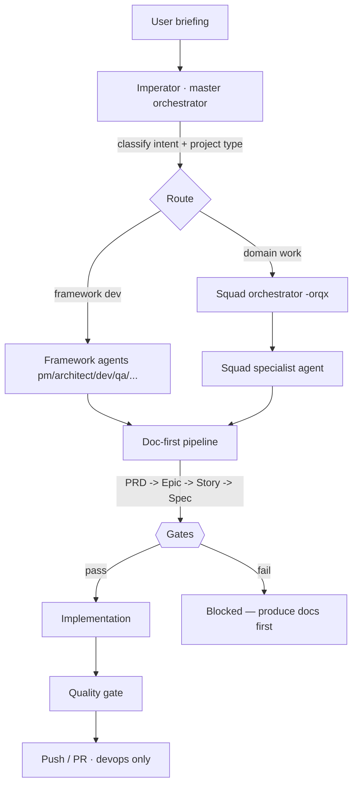
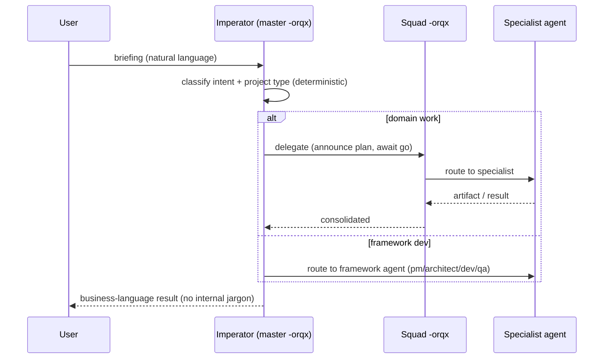
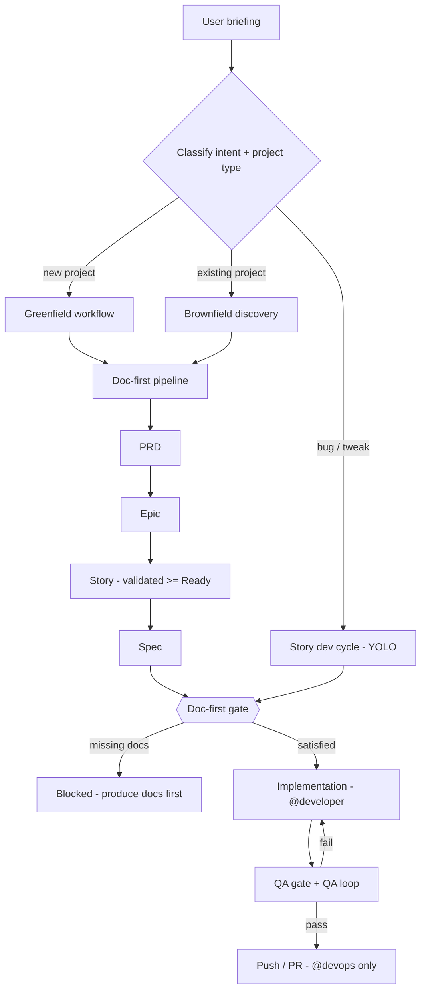
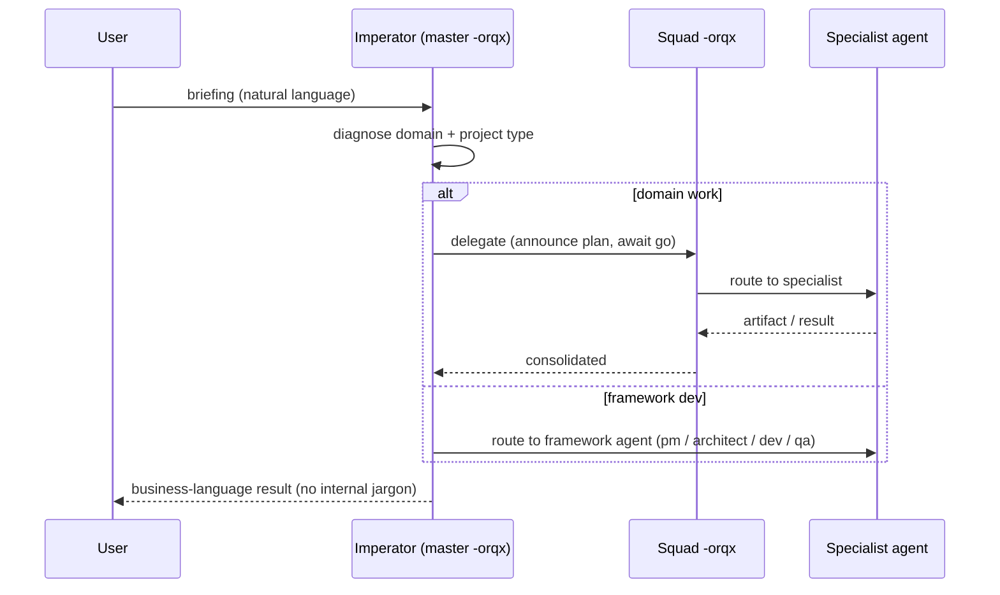
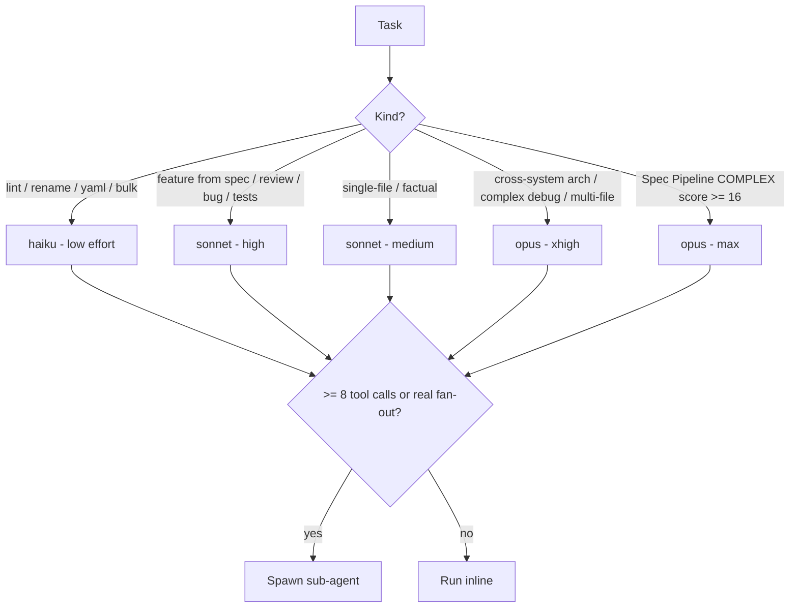
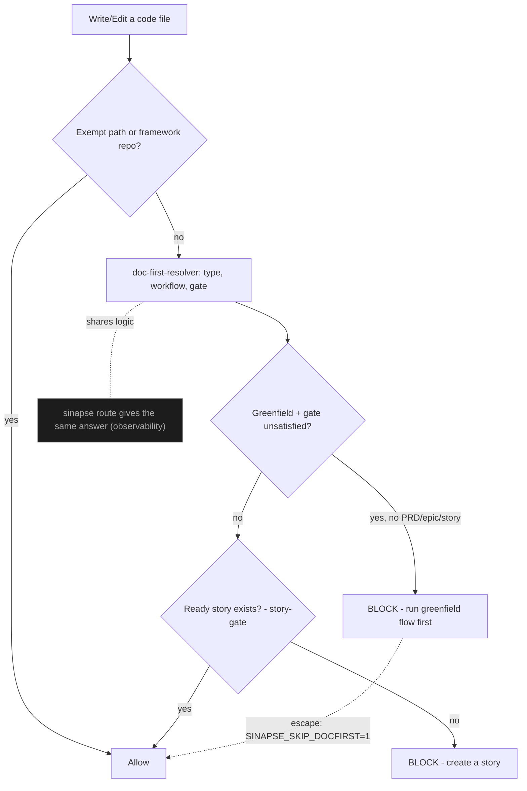
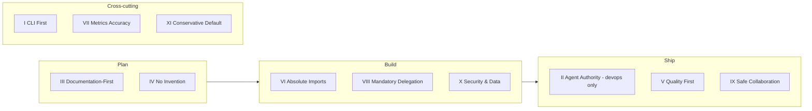
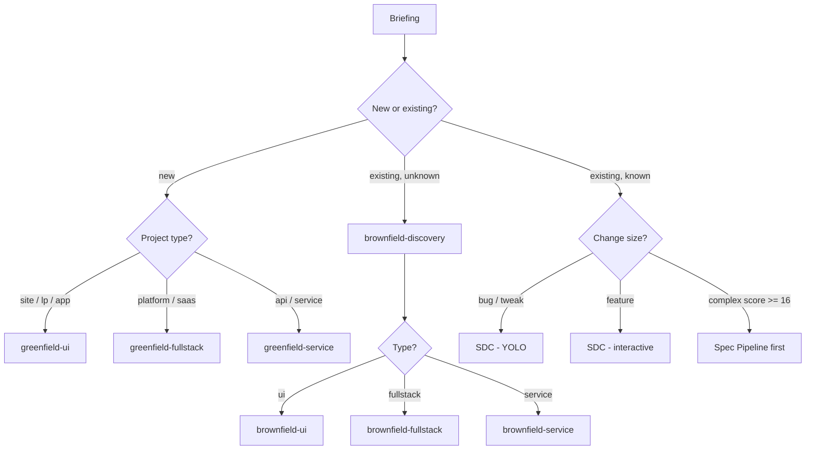

# SINAPSE — Framework Operating Atlas

> Single, generated map of how the SINAPSE framework works: routing, models,
> constitution, workflows, agents, squads. Regenerate with `sinapse atlas`.
> Counts are read from disk (Article VII — always exact).
> Generated: 2026-06-25T19:27:20.988Z

**At a glance:** 17 squads · 172 agents
(12 framework + 160 squad) ·
18 orchestrators · 98 workflows
(15 framework + 83 squad) ·
11 constitutional articles · 22 rules.

---

## 1. How SINAPSE works (operating model)

SINAPSE is a **meta-framework**: it does not run application code itself — it
orchestrates AI agents (inside Claude Code / Codex) through a governed pipeline.
Every user request flows through the same spine:



**Two routing decisions happen up front, both deterministic in spirit:**

1. **Agent routing** — the Imperator (master `-orqx`) absorbs the briefing,
   diagnoses the domain, and **delegates** to the right squad orchestrator,
   which in turn routes to a specialist. Orchestrators never execute domain work
   themselves (Article VIII — Mandatory Delegation). There are **18
   orchestrators** (17 squad + 1 master) fronting **172
   agents** across **17 squads**.

2. **Model routing** — each task picks the cheapest model that solves it
   (haiku → sonnet → opus), escalating only when needed. Documentation/spec work
   spends the tokens; execution then just reads the finished doc (see §4).

**Documentation-First is the law** (Article III). No project reaches code without
its planning documents. A briefing like "build a site" is forced through:

```
brief → PRD → Epic → Story (validated, status ≥ Ready) → Spec → implementation
```

The pipeline produces scannable approval tables in the terminal (requirements,
epics, stories) and is guarded so that a brand-new project cannot start coding
with no PRD / epic / story. Observability: `sinapse route "<brief>"` prints,
for any project, its type → workflow → which documents are missing → whether the
gate is satisfied — i.e. *exactly where it is breaking*.

This atlas is itself generated by `sinapse atlas`; its counts are read from disk,
so they are always exact.

---

## 2. Agent routing — briefing to specialist



Rules that make this deterministic, not improvised:
- **Article VIII — Mandatory Delegation:** an orchestrator that does domain work
  itself is a constitutional violation. Even "just do it yourself" → delegate.
- **Auto-routing:** the user never types an agent name; the system detects the
  domain and routes. Acknowledgement is business language, never `@agent-id`.
- **Project-type gate:** site / lp / app / platform / saas / api / service with
  no epic → the greenfield workflow is invoked *before* any code.

---

## 2b. Framework flows — how each mechanism runs

The meta-workflows of the framework itself (not the development workflows in
`docs/sinapse-workflows/`). Each is a single diagram you can read at a glance.

### End-to-end lifecycle

The full spine a request travels: from briefing to shipped code, with the doc-first pipeline and gates in the middle.



### Agent routing (delegation)

How a briefing reaches the right specialist. Orchestrators route and coordinate; they never execute domain work themselves (Article VIII).



### Model routing (cheapest that solves it)

How each task picks a model tier. Heavy thinking goes into the spec; execution then mostly reads a finished doc, so token economy is a consequence.



### Doc-first enforcement

What makes it impossible to start a new project without docs. The resolver answers what is missing; hooks block code writes until PRD + epic + story exist.



### Constitutional gates by phase

Where each non-negotiable article fires across the lifecycle — the enforcement layer that blocks violations automatically.



### Project classification to workflow

How intent maps to the right workflow: site/lp/app vs platform/saas vs api/service, greenfield vs brownfield, or a light fix.



---

## 3. Constitution — the 11 articles

Gates automatically block violations of NON-NEGOTIABLE / MUST articles.
*(Source of truth: `.sinapse-ai/constitution.md`.)*

| Art. | Principle | Severity |
|---|---|---|
| I | CLI First | NON-NEGOTIABLE |
| II | Agent Authority | NON-NEGOTIABLE |
| III | Documentation-First Development | NON-NEGOTIABLE |
| IV | No Invention | MUST |
| V | Quality First | MUST |
| VI | Absolute Imports | SHOULD |
| VII | Ecosystem Metrics Accuracy | NON-NEGOTIABLE |
| VIII | Mandatory Delegation | NON-NEGOTIABLE |
| IX | Safe Collaboration | NON-NEGOTIABLE |
| X | Security & Data Protection | NON-NEGOTIABLE |
| XI | Conservative Default | MUST |

---

## 4. Model routing (cheapest model that solves it)

The token economy is a consequence of the pipeline: heavy thinking goes into the
PRD/spec, so execution mostly *reads a finished document* instead of reasoning.

| Task | Model | Effort |
|---|---|---|
| Cross-system architecture, complex debug, multi-file refactor | **opus** | xhigh |
| Spec Pipeline COMPLEX (score ≥ 16) | **opus** | max |
| Feature from spec, code review, bug fix, tests, stories | **sonnet** | high |
| Single-file analysis, factual question | **sonnet** | medium |
| Lint, rename, YAML, lookup, bulk | **haiku** | low |

Rule of thumb: when in doubt, drop a tier and escalate only on failure. A
sub-agent is only spawned for real parallel fan-out (≥ 8 tool calls), otherwise
work runs inline. *(Source of truth: `.claude/rules/token-economy.md`.)*

---

## 5. Non-negotiable rules (22)

Loaded automatically by the harness. *(Source: `.claude/rules/`.)*

| Rule | What it governs |
|---|---|
| `agent-authority` | Agent Authority — Detailed Rules |
| `agent-handoff` | Agent Handoff Protocol — Context Compaction |
| `agent-memory-imports` | Agent Memory Imports |
| `coderabbit-integration` | CodeRabbit Integration — Detailed Rules |
| `cross-squad-routing` | Cross-Squad Routing Rules |
| `documentation-first` | Documentation-First Development |
| `hook-governance` | Hook Governance Rules |
| `ids-principles` | IDS Principles — Detailed Rules |
| `mandatory-delegation` | Mandatory Delegation |
| `mcp-usage` | MCP Server Usage Rules - SINAPSE Architecture |
| `nsn-mode` | NSN Mode — Never Say Never |
| `project-intelligence` | Project Intelligence — Auto-Detection |
| `response-format` | Response Format |
| `safe-collaboration` | Safe Collaboration — Git Safety Net |
| `security-data-protection` | Security & Data Protection |
| `security-scanning` | Security Scanning Rules |
| `squad-awareness` | Sinapse — Intelligent Auto-Routing |
| `story-lifecycle` | Story Lifecycle — Detailed Rules |
| `token-economy` | Token Economy & Response Format — NON-NEGOTIABLE |
| `tool-examples` | Tool Input Examples — Selection Guidance |
| `tool-response-filtering` | Tool Response Filtering — Dynamic Token Reduction |
| `workflow-execution` | Workflow Execution — Detailed Rules |

---

## 6. Workflow catalog (98 total)

**15 framework workflows** + **83
squad workflows**. The 13 primary framework workflows have detailed docs in
`docs/sinapse-workflows/`.

### Framework workflows (15)

| Workflow | Type | Description |
|---|---|---|
| `auto-worktree` | automation | Automatically creates and manages isolated worktrees for story development. Triggered when @developer starts working on a story, ensuring parallel development … |
| `brownfield-discovery` | brownfield | Comprehensive multi-agent discovery workflow for existing projects. Includes specialist validation cycles and executive awareness report. Designed for projects… |
| `brownfield-fullstack` | brownfield | Agent workflow for enhancing existing full-stack applications with new features, modernization, or significant changes. Handles existing system analysis and sa… |
| `brownfield-service` | brownfield | Agent workflow for enhancing existing backend services and APIs with new features, modernization, or performance improvements. Handles existing system analysis… |
| `brownfield-ui` | brownfield | Agent workflow for enhancing existing frontend applications with new features, modernization, or design improvements. Handles existing UI analysis and safe int… |
| `design-system-build-quality` | brownfield | Pipeline pós-migração para Design System. Encadeia sequencialmente as etapas de build, documentação, auditoria de acessibilidade e cálculo de ROI para garantir… |
| `development-cycle` | — | Workflow orquestrado para ciclo de desenvolvimento por story. Implementa o fluxo PO → Executor → Quality Gate → DevOps → Push com suporte a executor dinâmico, … |
| `epic-orchestration` | epic-orchestration | Reusable template for executing epics with wave-based parallel development. Stories within each wave run the full development-cycle workflow (PO → Executor → S… |
| `fast-track` | fast-fix | Streamlined workflow for trivial fixes that bypasses full story validation. Auto-generates a Ready story, simplified QA (lint + typecheck + test only). |
| `greenfield-fullstack` | greenfield | Agent workflow for building full-stack applications from concept to development. Supports both comprehensive planning for complex projects and rapid prototypin… |
| `greenfield-service` | greenfield | Agent workflow for building backend services from concept to development. Supports both comprehensive planning for complex services and rapid prototyping for s… |
| `greenfield-ui` | greenfield | Agent workflow for building frontend applications from concept to development. Supports both comprehensive planning for complex UIs and rapid prototyping for s… |
| `qa-loop` | loop | Automated QA loop that orchestrates the review → fix → re-review cycle. Runs up to maxIterations (default 5), tracking each iteration's results. Escalates to h… |
| `spec-pipeline` | pipeline | Pipeline completo que transforma requisitos informais em especificações executáveis. Orquestra as fases: Gather → Assess → Research → Write → Clarify → Critiqu… |
| `story-development-cycle` | generic | Ciclo completo de desenvolvimento de stories. Automatiza o fluxo desde a criação até a entrega com quality gate: create → validate → implement → QA review. Apl… |

### Squad workflows (83, grouped by squad)

| Squad | Workflows |
|---|---|
| `claude-code-mastery` | `optimization-cycle`, `project-setup-cycle`, `wf-audit-complete`, `wf-knowledge-update`, `wf-project-setup` |
| `squad-animations` | `3d-scene-creation-cycle`, `animation-quality-review-cycle`, `generative-art-creation-cycle`, `prompt-to-animation-cycle`, `scroll-experience-creation-cycle` |
| `squad-brand` | `brand-application-cycle`, `brand-diagnosis-cycle`, `client-idv-delivery-cycle`, `zero-to-brand-system-cycle` |
| `squad-cloning` | `full-clone-pipeline`, `quality-validation-cycle`, `source-discovery-cycle`, `tier1-kb-only`, `tier2-consultant`, `tier3-full-clone` |
| `squad-commercial` | `churn-prevention-protocol`, `client-onboarding-activation`, `expansion-revenue-cycle`, `new-offer-launch`, `quarterly-commercial-review`, `revenue-forecasting-cycle` |
| `squad-content` | `content-audit-cycle`, `content-creation-cycle`, `editorial-planning-cycle`, `onboarding-content-cycle`, `performance-feedback-loop`, `signal-to-content-cycle` |
| `squad-copy` | `brand-voice-development`, `campaign-copy-cycle`, `content-copy-cycle`, `conversion-copy-sprint`, `full-copy-cycle`, `sales-copy-pipeline` |
| `squad-council` | `business-audit-cycle`, `strategic-advisory-session` |
| `squad-courses` | `course-launch-cycle`, `course-quality-review`, `full-course-creation`, `presentation-creation`, `video-course-production`, `written-course-creation` |
| `squad-cybersecurity` | `incident-response-cycle`, `security-audit-workflow` |
| `squad-design` | `a11y-compliance-cycle`, `design-system-build-cycle`, `landing-page-sprint`, `performance-remediation-cycle`, `ux-research-sprint`, `zero-to-digital-product-cycle` |
| `squad-finance` | `client-profitability-audit`, `monthly-financial-cycle`, `pricing-design-cycle`, `quarterly-financial-review` |
| `squad-growth` | `analytics-instrumentation-pipeline`, `campaign-performance-review`, `cro-experimentation-sprint`, `full-growth-analytics-cycle`, `growth-experiment-loop`, `seo-audit-optimization-cycle` |
| `squad-paidmedia` | `account-audit-cycle`, `campaign-launch-cycle`, `creative-testing-cycle`, `cro-optimization-cycle`, `scaling-sprint` |
| `squad-product` | `client-roadmap-alignment-cycle`, `product-discovery-cycle`, `product-handoff-cycle`, `product-launch-cycle`, `product-strategy-definition-cycle`, `story-development-delivery-cycle` |
| `squad-research` | `audience-intelligence-cycle`, `competitive-intelligence-cycle`, `deep-research-cycle`, `full-research-sprint`, `market-analysis-cycle`, `trend-forecasting-cycle` |
| `squad-storytelling` | `wf-pitch-narrative`, `wf-story-development` |

---

## 7. Agents & squads map

**172 agents** = 12 framework +
160 squad, fronted by **18 orchestrators**.

### Orchestrators (18) — the routing layer

| Orchestrator | Persona | Squad | Role |
|---|---|---|---|
| `swarm-orqx` | Nexus | claude-code-mastery | Multi-Agent Systems Architect & Swarm Orchestration Specialist |
| `snps-orqx` | Imperator | framework | Supreme Orchestrator of all 17 SINAPSE Squads (172 agents) |
| `animations-orqx` | Kinetic | squad-animations | Animation Squad Orchestrator |
| `squad-brand` | Meridian | squad-brand | Brand Squad Orchestrator — coordena os 14 agentes especialistas do squad |
| `squad-cloning` | Helix | squad-cloning | Clone Pipeline Orchestrator — coordena o pipeline completo de clonagem cognitiva |
| `commercial-orqx` | — | squad-commercial | Revenue Cycle Orchestrator |
| `squad-content` | Nexus | squad-content | Content Pipeline Orchestrator — coordena todo o fluxo de deteccao, producao, publicacao e analise |
| `squad-copy` | Quill Prime | squad-copy | Copy Squad Orchestrator — coordena os 12 agentes especialistas do squad |
| `council-orqx` | Zenith | squad-council | Strategic Council Orchestrator & Wisdom Synthesizer |
| `squad-courses` | Syllabus | squad-courses | Course Project Orchestrator — coordena o ciclo completo de criacao de cursos |
| `cyber-orqx` | Cyber Orchestrator | squad-cybersecurity | Cyber Defense Operations Orchestrator & Ethical Oversight |
| `design-orqx` | Nexus | squad-design | Digital Experience Orchestrator |
| `finance-orqx` | Ledger | squad-finance | Financial Intelligence Orchestrator |
| `growth-orqx` | Catalyst | squad-growth | Growth Orchestrator |
| `paidmedia-orqx` | Apex | squad-paidmedia | Paid Media Squad Orchestrator |
| `product-orqx` | — | squad-product | — |
| `research-orqx` | Prism | squad-research | Research Operations Conductor |
| `storytelling-orqx` | Arc | squad-storytelling | Narrative Masters Squad Commander & Narrative Router |

### Squads (17)

| Squad | Name | Agents | Workflows | Orchestrator(s) |
|---|---|---|---|---|
| `claude-code-mastery` | Claude Code Mastery Squad | 8 | 5 | `swarm-orqx` |
| `squad-animations` | Squad Animations | 9 | 5 | `animations-orqx` |
| `squad-brand` | squad-brand | 15 | 4 | `squad-brand` |
| `squad-cloning` | Squad Cloning | 9 | 6 | `squad-cloning` |
| `squad-commercial` | Squad Commercial | 10 | 6 | `commercial-orqx` |
| `squad-content` | Squad Content | 7 | 6 | `squad-content` |
| `squad-copy` | Squad Copy | 13 | 6 | `squad-copy` |
| `squad-council` | Squad Council | 11 | 2 | `council-orqx` |
| `squad-courses` | Squad Courses | 8 | 6 | `squad-courses` |
| `squad-cybersecurity` | Squad Cybersecurity | 8 | 2 | `cyber-orqx` |
| `squad-design` | Squad Design | 14 | 6 | `design-orqx` |
| `squad-finance` | Squad Finance | 8 | 4 | `finance-orqx` |
| `squad-growth` | Squad Growth | 7 | 6 | `growth-orqx` |
| `squad-paidmedia` | Squad Paid Media | 9 | 5 | `paidmedia-orqx` |
| `squad-product` | Squad Product | 7 | 6 | `product-orqx` |
| `squad-research` | Squad Research | 7 | 6 | `research-orqx` |
| `squad-storytelling` | Squad Storytelling | 10 | 2 | `storytelling-orqx` |

> The full 172-agent index is in the generated
> `atlas-data.json` (one object per agent, with file path and role).

---

*Generated by `.sinapse-ai/core/atlas` · data: `docs/framework/atlas/atlas-data.json`.*
