# Auditoria estratégica da evolução

Auditado em 2026-10-02, worktree `framework-evolution/sinapse-ai`, branch `codex/feat/framework-evolution-20261002`, HEAD `47f421cb1d813875504815734acd15562bbeca01`. Auditoria documental e por amostras; não reexecuta os testes reportados, nem comprova qualidade dos artefatos ausentes.

## Veredicto

**O plano é uma base de infraestrutura útil, mas ainda não é o plano mais forte para melhorar entregáveis.** Preserva autoridade, direitos, evidência e limites; a próxima onda precisa trocar expansão de cobertura por avaliação de artefatos, aprendizagem com o usuário e promoção por competência.

Os 172 perfis, 512 entregáveis, 90 referências e 119 oportunidades Jev medem cobertura do inventário. Nenhuma dessas contagens mede especialização adquirida. O próprio plano registra essa distinção; o problema é que o trabalho seguinte ainda não transforma a distinção em critérios operacionais suficientes.

Não atribuo nota percentual ao plano. Os oito achados abaixo sustentam o veredicto. Severidade HIGH significa risco direto ao objetivo declarado; MEDIUM significa perda de eficiência ou rastreabilidade. Nenhum achado acusa violação de segurança ou execução paga indevida.

## Achados

| ID / severidade | Evidência | Consequência e correção |
|---|---|---|
| S1 HIGH — benchmark sem produto | `verification.md:26–38`; `benchmark-protocol.json:12–22`; `benchmark-blind-review.json:6` | 10 decisões escritas, uma geração por variante e escala 0/1/2 não avaliam composição, áudio, movimento ou produto final. Preservar como teste de julgamento; acrescentar baseline/enriquecido renderizados com avaliação técnica e criativa separadas. |
| S2 HIGH — contratos semanticamente fracos | `expert-profiles.json:9702–9730`, `:18838–18864` | Storybook associado à configuração de arquitetura, documentação de arquitetura associada a build tooling; frase de princípio virou competência/entregável. Conferir mapa explícito tarefa → competência → entregável; não completar por posição ou por qualquer bullet encontrado. |
| S3 HIGH — prioridade ampla sem retorno nem capacidade | `PLAN.md:25–43`; `source-program.json:1271–1281`; perfis: 49 P1/123 P2, nenhum P0 | Documento usa P0/P1/P2; programa e perfis usam outra escala. Faltam frequência de uso, retrabalho, impacto, esforço e WIP. Ordenar famílias de entregáveis pelo problema observado; manter até três famílias ativas e uma competência por família. |
| S4 HIGH — aquisição orientada a quota de fontes | `source-program.json:12–15`, `:1283–1374`; `PLAN.md:105–108`; `verification.md:10–12` | 88/90 referências candidatas e aceites repetidos de duas fontes são backlog de aquisição, não métodos dominados. Uma fonte nova precisa resolver falha observada ou acrescentar mecanismo, exceção ou conflito; registrar independência, contexto de transferência e benefício testado. |
| S5 HIGH — revisão humana sem ciclo de aprendizagem | `expert-profiles.json:9798–9818` (estágios); `PLAN.md:115–124`; `expertise.md:124–130` | Há revisão como etapa, mas não um registro de correção do Caio, causa, regra proposta, exceção e teste de transferência. Capturar feedback por artefato/competência e manter preferências pessoais ou de cliente separadas de métodos gerais. |
| S6 MEDIUM — Jev sem default de extração persistente | `PLAN.md:80–90`; `jev-use-cases.json:5–44`; `expertise.md:102–119` | O catálogo inclui rota/aplicabilidade/revisão por caso; não há default explícito de extração por versão da fonte com cache, seguido de produção sem Jev. Não há chamadas pagas indevidas: é lacuna de desenho. Tratar julgamentos em produção como experimento separado, mediante benefício medido. |
| S7 MEDIUM — custos e atualização sem política por competência | `model-policy.json:3–5`, `:85–97`; `PLAN.md:110–113`; `source-program.json:1276–1281` | Validade de 30 dias e limites de tentativa existem; faltam custo total por artefato, tempo até aprovação, frequência/causa de revisão do método e orçamento incremental de aquisição. Medir custos conhecidos e desconhecidos; invalidar somente competências afetadas por mudança ou falha. |
| S8 MEDIUM — efeitos das mudanças não isolados | `benchmark-protocol.json:24–30`; `verification.md:26–38` | Enriquecido muda corpus e perfil juntos. Preferência por variante não atribui melhoria a fonte, recuperação, perfil ou modelo. Primeiro testar modelo fixo; depois comparar baseline, KB recuperada, KB+perfil. Novos modelos e Jev exigem coortes próprias. |

Locators JSON são relativos a `research/expert-evolution`; documentos são relativos a `docs/framework/expert-evolution-2026-10`. As amostras S2 provam problemas específicos, sem extrapolar que todos os 512 contratos estejam errados.

## Alternativas

| Alternativa | Ganho | Custo / limite |
|---|---|---|
| 1. Expandir aquisição dos 172 perfis agora | Cobertura documental rápida | Amplia conhecimento sem identificar qual falha ele resolve; alto risco de trabalho sem melhoria percebida. |
| **2. Evoluir por três famílias de artefatos — recomendada** | Prova melhoria em UI+motion, vídeo/Reel e carrossel; aprende com retrabalho real | Mantém parte dos perfis planejada até transferir métodos validados. Não promete especialização universal. |
| 3. Refazer taxonomia completa antes de produzir | Corrige coerência estrutural global | Atrasa provas visuais e de negócio; usar correção estreita de contratos da opção 2, ampliar somente com defeitos demonstrados. |

## Sequência corrigida em DAG

```mermaid
flowchart LR
  A[Definir três famílias e medir baseline] --> B[Corrigir contratos e critérios]
  B --> C[Produzir seis artefatos comparáveis]
  C --> D[Revisão independente e feedback]
  D --> E[Adquirir métodos para falhas observadas]
  E --> F[Extrair uma vez por versão e testar transferência]
  F --> G[Promover competências e distribuir localmente]
  E -. acesso opcional .-> J[Piloto Jev até US$ 0,05]
  J -. evidência complementar .-> F
  F -. acesso opcional .-> M[Coorte própria de modelo candidato]
  M -. melhoria comprovada .-> G
```

| Fase | Execução e responsável sugerido | Aceite mensurável | Pode começar agora? |
|---|---|---|---|
| A — valor e baseline | Product identifica as três famílias; design/content fornecem briefs locais autorizados, identidade e assets. Rank por frequência de uso, gravidade do retrabalho, impacto, confiança e esforço; desconhecido fica explícito. | Três briefs congelados, um por família; unidade é artefato aprovado por usuário/brief, não perfil. WIP máximo três famílias, uma competência em evolução por família. Baseline inclui tempo, retrabalho, custo observado e limites. | Sim, com fixtures próprios. Histórico de uso ausente pode começar como hipótese identificada; não inventar ROI. |
| B — contratos | Especialista responsável por cada entregável confere relação entre competência, tarefa canônica, artefato e critério; quality-gate separa técnica de estética. | 100% dos contratos dos três briefs revisados; zero mapeamentos posicionais injustificados; critérios críticos e pesos congelados antes de gerar. | Sim. Workers podem adicionar mapas e rubrics candidatos; alterar runtime/programa somente na frente autorizada pelo root. |
| C — primeira comparação | Design/frontend/motion executam UI+motion; content/media executam Reel e carrossel. Mesmo modelo, brief, assets e limites; contexto baseline e contexto enriquecido identificados por hash. | Seis artefatos locais reais, três pares; UI capturada em desktop/390px sem overflow; vídeo codificado com áudio/legendas e timecodes; carrossel exportado na dimensão final. Sem alegar publicação ou significância estatística. | Sim, em fixture isolado, sem cliente/produção; capacidades de render ausentes devem ser reportadas. |
| D — revisão e aprendizagem | Reviewer diferente do executor vê ordem aleatória. Revisão técnica, revisão criativa e escolha do Caio são registros separados; uma divergência exige revisão limitada, não fonte extra automática. | Zero falhas críticas. Rubric criativa de cinco dimensões ancoradas; alvo proposto ≥90/100 e nenhuma dimensão <15/20. Cada rejeição produz causa, evidência, correção e teste novo. Feedback do Caio ainda não recebido permanece pendente. | Revisão independente pode começar. Calibração do gosto e aprovação do Caio dependem de retorno dele; não bloqueiam documentação ou diagnóstico. |
| E — aquisição orientada à falha | Pesquisa/cloning obtêm somente seção pública ou material autorizado que ataque uma falha observada; buscam exceção e alternativa. | Cada nova unidade tem fonte/locator/hash, mecanismo, condição, exceção, consumidor e caso que motivou a coleta. Máximo duas tentativas por fonte; suspender família após dois lotes sem mecanismo novo aplicável nem redução do erro observado. | Sim com conteúdo autorizado disponível. Obra privada sem acesso/direito fica candidata; compra/login não são inferidos. |
| F — persistência e transferência | Extração/curadoria em lote; Jev opcional por fonte/versão, ledger compartilhado. Testar competência em três briefs novos por família, duas repetições por variante, com modelo fixo. | Cache idêntico evita extração paga repetida; 36 saídas reservadas nesta etapa são teto de piloto, não quota universal. Reportar distribuição de notas, preferência, falhas, custo e retrabalho; não alegar causalidade ou significância sem análise própria. Qualquer falha crítica bloqueia promoção da competência. | Preparação offline e testes nativos podem começar. Jev live exige chave no fluxo seguro; orçamento já autorizado até US$ 0,05, sem repetir aprovação. |
| G — promoção e distribuição | Quality-gate avalia competência específica; architect/runtime verificam contexto, instalação em fixture e rollback. Escalar próxima família pelo benefício observado. | Promoção contém competência, versão, conjunto avaliado, fontes, métricas e limites; nenhuma promoção dos 172 por associação. Fixtures limpas e atualização verificadas; nova família entra quando outra conclui ou é suspensa. | Sim para fixtures; HOME real, outros projetos e publicação mantêm os gates atuais. |

O DAG é recomendação de sequência para o root e especialistas. Não é spec, PRD nem autorização de execução externa. O piloto Jev e candidatos de modelo são ramos opcionais; sua indisponibilidade não impede qualidade local com o runtime disponível.

## Rubric proposta para não confundir 90/100 com opinião vaga

Cinco dimensões de 0–20: adequação ao brief/marca; hierarquia e legibilidade; composição e distintividade; continuidade/ritmo/interação; acabamento no formato final. A adaptação concreta por mídia e os exemplos âncora precisam ser aprovados por design/content antes da comparação.

Âncoras por dimensão: 0 = ausente/inutilizável; 5 = falha grave; 10 = funciona com retrabalho grande; 15 = consistente com ajustes menores; 20 = referência aprovada para o brief, com prova observável. Score é critério operacional proposto, não resultado observado.

Factualidade, direitos, produto correto, ações críticas, acessibilidade pertinente e ausência de overflow são gates de aprovação independentes: nota estética não compensa falha crítica. Não somar nota técnica e estética para esconder regressão. Aceite final do usuário continua explícito.

## Implementações que a próxima onda pode fazer sem acesso externo

- Corrigir o mapa dos contratos prioritários, unificar semântica de prioridade e registrar WIP por família.
- Adicionar briefs/artefatos candidatos, rubrics ancoradas, manifesto/hash e protocolo de comparação com modelo fixo.
- Registrar feedback, retrabalho, tempo/custo e causa de mudança; distinguir preferência de Caio/cliente de método transferível.
- Marcar extração persistente como default; preservar catálogo Jev como hipóteses, com cache/versão, branch opcional e zero execução por output como default.
- Adicionar validade por competência, gatilhos de reavaliação e promoção limitada; preservar o benchmark escrito como cobertura parcial.

## Bloqueios reais e limites

Credencial Jev e acesso autenticado ao modelo candidato estão ausentes da evidência atual. Acesso Mobbin observado não autoriza redistribuir capturas. Livros completos/cursos privados sem material autorizado permanecem candidatos. Instalação pessoal e publicação não estão incluídas nesta auditoria.

O retorno do Caio é necessário para calibrar preferência e comprovar aprovação do entregável. Pode ser coletado ao mostrar os pares; não exige interromper a preparação local para uma pergunta abstrata antes de haver artefatos.

Memória consultada: `MEMORY.md:1136,1151` registra preferência anterior, em conteúdo Caio, por Jev apenas na extração persistente. É antecedente de desenho, não proibição global inferida. Os preços/modelos antigos da memória não foram usados como dados atuais.

## Limite de trabalho da auditoria

Até três iterações: levantamento, contraposição por amostras, síntese/verificação dos dois artefatos. Nenhuma pesquisa externa nova, chamada paga, mudança no plano vigente, código, fonte, modelo, ambiente global ou cliente. Recomendações dependem da revisão dos especialistas estreitos coordenada pelo root.
